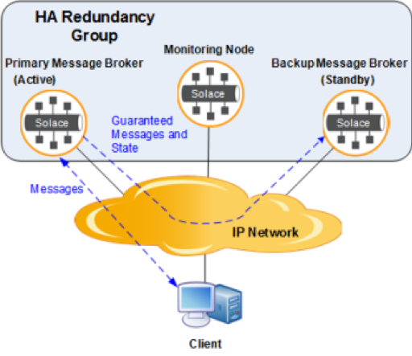
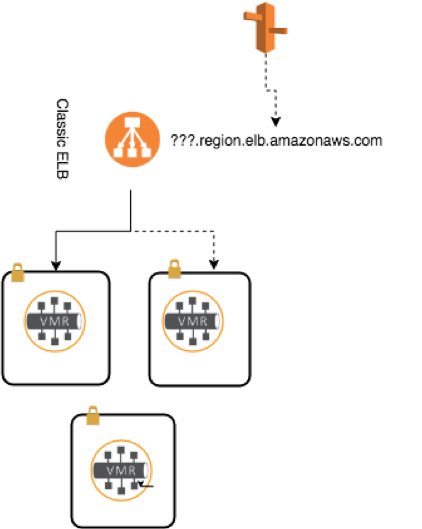
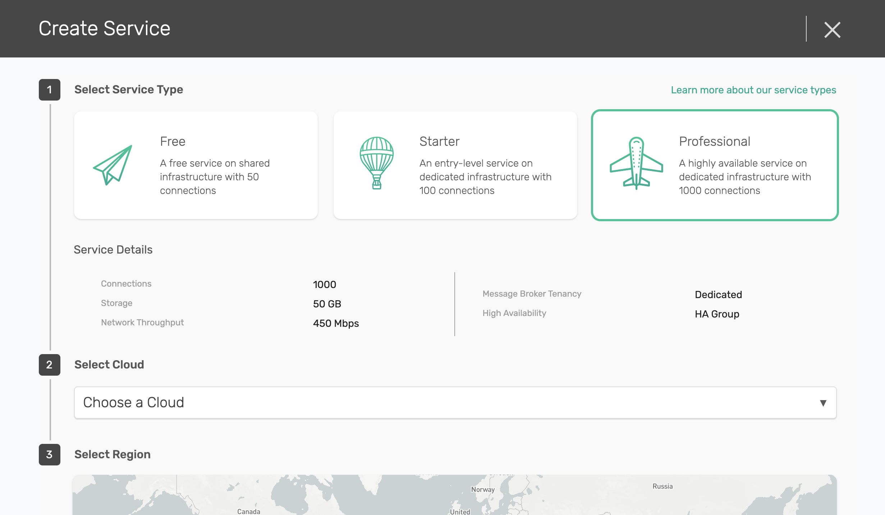
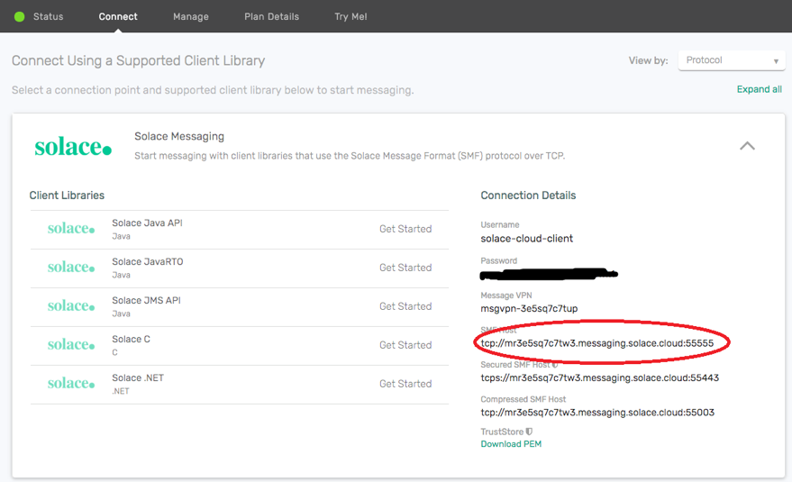

PubSub+ Cloud HA Overview
============================

PubSub+ Cloud offers plans which provides a PubSub+ Broker deployed in high-availability (HA) redundancy groups for fault
tolerance.  HA redundancy provides 1:1 message broker sparing to increase overall service availability.  If one of the message
brokers fails or is taken out of service, the other message broker automatically takes over and provides service to the clients
that were previously served by the now-out-of-service message broker.

This section introduces HA concepts and network topologies supported in PubSub+ Cloud.
The core underlying feature of an HA redundancy group can be found at `Redundancy and Fault Tolerance <https://docs.solace.com/Features/SW-Broker-Redundancy-and-Fault-Tolerance.htm>`_ .

PubSub+ Cloud automates this HA redundancy group setup, and makes it easy to use.

Concepts
~~~~~~~~

PubSub+ Cloud provides HA by using an Active-Standby model with an arbiter node (Monitoring Node) for split-brain detection.
This requires three nodes each running the software message broker on three nodes:

- Primary node
- Backup node
- Monitoring node

The Primary and Backup nodes both run the PubSub+ Broker software under the messaging node role, while the Monitor Node runs
it under the monitoring node role.  Each of their respective roles, is fixed by the configuration and never changes.

When in operation, the Primary and Backup nodes will assume one of these activity states: **Active** or **Standby**. At any one point in
time, one node is **Active**, the other on is **Standby**

Upon a failover, connections to the PubSub+ Broker are switched over from the **Active** to the **Standby** node automatically.

High availability in PubSub+ Cloud
~~~~~~~~~~~~~~~~~~~~~~~~~~~~~~~~~~

The goal of PubSub+ Cloud is to make the usage of the HA Redundancy Group as simple as possible.  Typically, applications would
have to provide a host list, i.e. one IP address for the Primary node and another for the Backup node.  When using the Solace Enterprise
APIs, the switchover would be handled by the API automatically.

This approach (providing hosts list) will not work for 3rd-party Messaging APIs, therefore PubSub+ Cloud simplifies this by having a single
DNS entry for applications to use (behind a load balancer) abstracting away the switchover between Primary and Backup in the event of a failure.

How to Create an HA Redundancy Group in PubSub+ Cloud
~~~~~~~~~~~~~~~~~~~~~~~~~~~~~~~~~~~~~~~~~~~~~~~~~~~~~

Currently any dedicated tenancy plans in PubSub+ Cloud deploys an HA redundancy group by default.

PubSub+ Cloud automates all of the configuration and setup when a user creates the service.  Once the service is created, applications can
use the dns name entry provided in the connectivity tab in PubSub+ Cloud.

Conclusion
~~~~~~~~~~

PubSub+ Cloud provide a robust & automatic redundant and fault tolerant solution for applications requiring high availability.  PubSub+
Cloud lets users bring up an HA group with just a few clicks.

