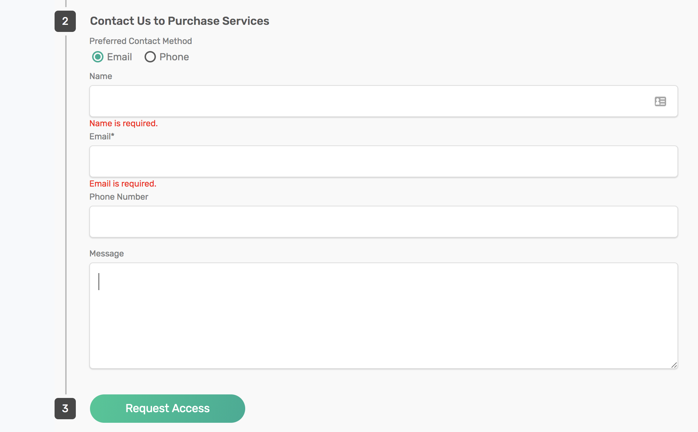
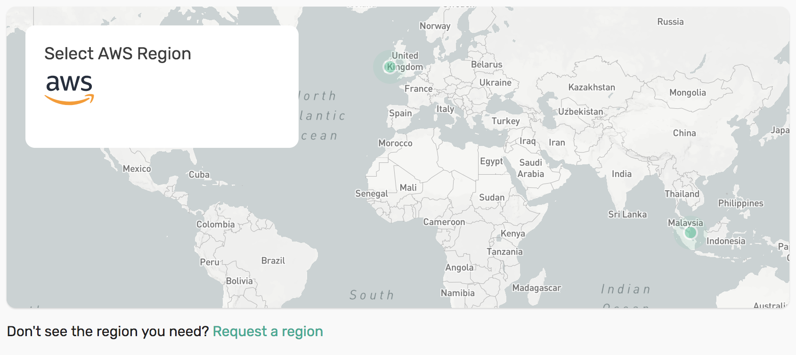
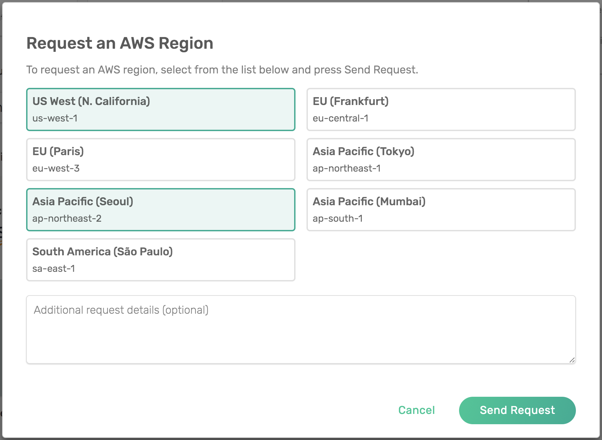

Frequently Answered Questions
=============================

What are plans in Solace PubSub+ cloud?
~~~~~~~~~~~~~~~~~~~~~~~~~~~~~~~~~~~~~~~

On PubSub+ Cloud you could choose a plan to use for your messaging needs, below are the enterprise plans PubSub+ cloud offers:

* Nano (This is shared plan which could be used by developers)
* Kilo
* Mega
* Giga
* Tera

How can I get access to bigger plans such as Enterprise Mega and Giga?
~~~~~~~~~~~~~~~~~~~~~~~~~~~~~~~~~~~~~~~~~~~~~~~~~~~~~~~~~~~~~~~~~~~~~~

If you signed up for free on `our website <https://cloud.solace.com>`_ you will be using a Basic account which only has access to the Free, Nano and Kilo plans. In order to use the bigger plans, such as Enterprise Mega and Giga, you must upgrade to an Enterprise account. To do this please `contact us <https://console.solace.cloud/support>`_.

How do I get access to enterprise plans?
~~~~~~~~~~~~~~~~~~~~~~~~~~~~~~~~~~~~~~~~

On the PubSub+ Cloud `Create Service <https://console.solace.cloud/services/create>`_ page, in Step 1, select the enterprise plan you want to use. Step 2 will display a contact form. Get in touch with a Solace representative and we'll get you set up.

How are plans used?
~~~~~~~~~~~~~~~~~~~

There are two ways you could use an enterprise plan, you can ask for a Prepaid Subscription or for On-Demand services.

How do I know what plan is best for my needs?
~~~~~~~~~~~~~~~~~~~~~~~~~~~~~~~~~~~~~~~~~~~~~

To understand the details of the plans offered by PubSub+ cloud, please visit the pricing page on our site, the plans differ on number of connections
Throughput, Usage and Storage:
`Plans Pricing <https://cloud.solace.com/pricing/>`_ page

Can I change my plans?
~~~~~~~~~~~~~~~~~~~~~~~

You could raise a request to change the plan best suitable for your needs and our production engineering team will help you with it.

I have reached my limit, how can I get a higher plan limit?
~~~~~~~~~~~~~~~~~~~~~~~~~~~~~~~~~~~~~~~~~~~~~~~~~~~~~~~~~~~

You could raise a request to add a plan best suitable for your needs and our production engineering team will help you with it.

How do On Demand plans work compared to Prepaid Subscription?
~~~~~~~~~~~~~~~~~~~~~~~~~~~~~~~~~~~~~~~~~~~~~~~~~~~~~~~~~~~~~

The differences between On Demand and Prepaid Subscription plans are well described here:
`Concept On-Demand vs Prepaid Subscription <https://cloud.solace.com/learn/group_concepts>`_

You could use a mix of both On Demand and Prepaid subscriptions in your account. Most customers will choose Prepaid plans for applications with predictable usage,
and use on-demand to cover any overages, for new applications or for those applications with variable usage.

What's the advantage to having a subscription?
~~~~~~~~~~~~~~~~~~~~~~~~~~~~~~~~~~~~~~~~~~~~~~

Prepaid Subscriptions provide you a discount in return for a longer-term commitment and help you minimize your invoicing overhead.

What clouds and regions are available?
~~~~~~~~~~~~~~~~~~~~~~~~~~~~~~~~~~~~~~

This information is available at the bottom of our `pricing page <https://cloud.solace.com/pricing/>`_. We are always adding more clouds and regions based on demand. If you don't see a region that you need, please get in touch with us by using the `support page in our console <https://console.solace.cloud/support>`_.  If you don't yet have access to our console you can `sign up for free <https://cloud.solace.com/signup/>`_.

Why aren't all of the regions listed on the `pricing page <https://cloud.solace.com/pricing/>`_ available when I'm creating a service?
~~~~~~~~~~~~~~~~~~~~~~~~~~~~~~~~~~~~~~~~~~~~~~~~~~~~~~~~~~~~~~~~~~~~~~~~~~~~~~~~~~~~~~~~~~~~~~~~~~~~~~~~~~~~~~~~~~~~~~~~~~~~~~~~~~~~~~

Only certain regions are available when creating a Free service.  Free service regions are marked with an asterisk on our `pricing page <https://cloud.solace.com/pricing/>`_. Even if you're not using a Free service, you may notice that some regions are not available. This is because we list all of the "Available" regions on our website, while only the "Enabled" regions can be used when creating a service.

"Available" regions are those which have been identified as having the IaaS resources that are required to run our messaging services. "Enabled" regions are those in which PubSub+ Cloud infrastructure is installed and ready to create messaging services.

Can I request a region listed on the `pricing page <https://cloud.solace.com/pricing/>`_ to be available when I'm creating a service?
~~~~~~~~~~~~~~~~~~~~~~~~~~~~~~~~~~~~~~~~~~~~~~~~~~~~~~~~~~~~~~~~~~~~~~~~~~~~~~~~~~~~~~~~~~~~~~~~~~~~~~~~~~~~~~~~~~~~~~~~~~~~~~~~~~~~~

Yes, we add regions to PubSub+ Cloud based on customer demand and you can request a region from our Create Service screen.

* Click the "Request a region" link under the map

* Select the regions you want to request, enter any specific notes about your request and click "Send Request"

Our Production Engineering team will contact you shortly.

Can I deploy PubSub+ Cloud messaging services in my own VPC?
~~~~~~~~~~~~~~~~~~~~~~~~~~~~~~~~~~~~~~~~~~~~~~~~~~~~~~~~~~~~

Yes, we can setup a private datacenter for your organization that will create PubSub+ Cloud messaging services in your own VPC.
To set this up, you can contact Solace PubSub+ Cloud support and our Production Engineering team will contact you shortly.

What are the advantages and disadvantages of deploying PubSub+ Cloud messaging services in my own VPC?
~~~~~~~~~~~~~~~~~~~~~~~~~~~~~~~~~~~~~~~~~~~~~~~~~~~~~~~~~~~~~~~~~~~~~~~~~~~~~~~~~~~~~~~~~~~~~~~~~~~~~~

The advantages to using your own VPC are:

* All messaging traffic can be private
* Can achieve the best performance and latency for messaging access
* Can receive the lowest IaaS costs for network data usage

The advantages of using the PubSub+ Cloud regions are:

* Simpler to start up a service
* No local setup or installation required
* No management of your own cloud resource thresholds required

What are the benefits of using PubSub+ Cloud over running the PubSub+ Broker myself?
~~~~~~~~~~~~~~~~~~~~~~~~~~~~~~~~~~~~~~~~~~~~~~~~~~~~~~~~~~~~~~~~~~~~~~~~~~~~~~~~~~~~

PubSub+ Cloud messaging services are fully managed by Solace and come with many advantages, including:

* Start up a messaging service anywhere in the world immediately with the press of a button
* Carefully engineered PubSub+ Broker deployment for the different clouds to achieve optimal speed and resiliency
* Fully managed, lossless upgrades
* 24x7 support