Creating a Queue
================

Once you have :doc:`created a messaging service <ggs_signup>` and :doc:`tried it out <ggs_tryme>`, you may want to create a queue so you can send and receive some guaranteed messages. This tutorial will walk you through creating a queue. You will also make sure the queue is working by connecting a publisher and publishing a matching message to that queue.

Goals
~~~~~
The goal of this tutorial is to demonstrate how to create a queue and confirm that it is working. This tutorial will show you:

* How to create a queue
* How to map a topic to a queue
* How to publish a message a queue

Step 1: Go to Management tab
~~~~~~~~~~~~~~~~~~~~~~~~~~~~

To access the Management tab, follow the steps below.

1. Go to your messaging services page by selecting Services from the top navigation bar.
2. Select your messaging service to navigate to messaging service details.
3. On the service details page, navigate to the **Management** tab.

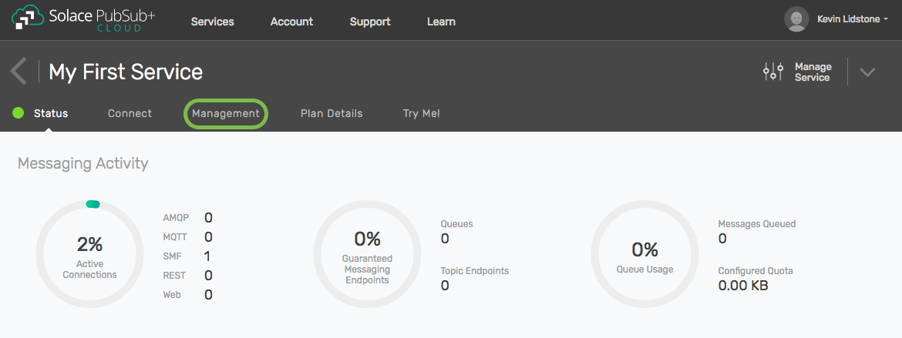

4. You will then see the Management tab which provides access to tools for managing your messaging service.

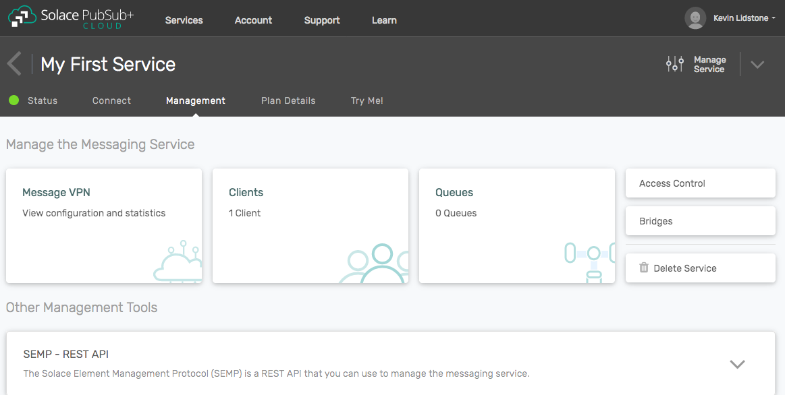

Step 2: Create a Queue using the Queue management window
~~~~~~~~~~~~~~~~~~~~~~~~~~~~~~~~~~~~~~~~~~~~~~~~~~~~~~~~

From the Management tab you can open the Queue management window where you can work with queues in your messaging service.

To create a queue, follow the steps below.

1. Click on the **Queues** tile on the Management tab. This will open the Queue management window in a new browser tab.

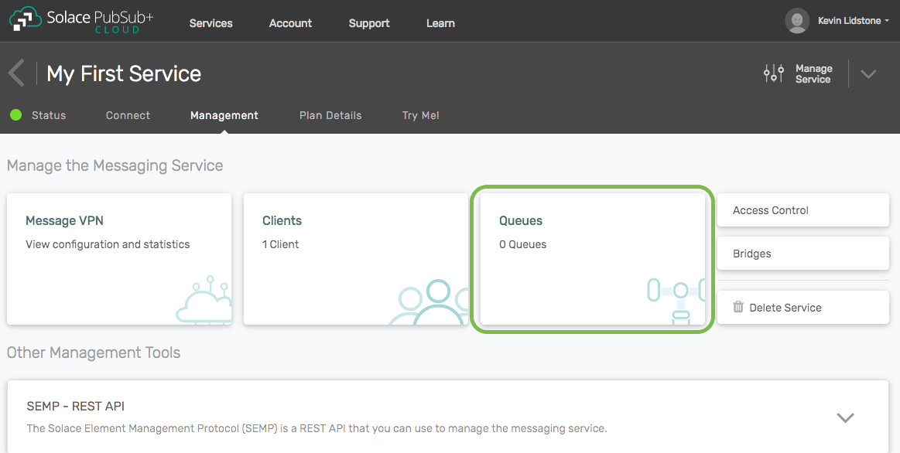

2. Click on the **+Queue** button.

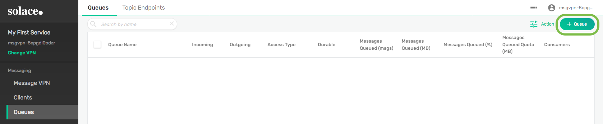

3. Enter a name for your queue and click **Create**. You can use most characters in your queue name, including spaces. Some punctuation marks ('<>*?&;) are not allowed. If you use a slash (/) in the name, it cannot be the first character.

.. raw:: html

    

4. When prompted to adjust the queue settings, click on **Apply** to accept all the default settings.

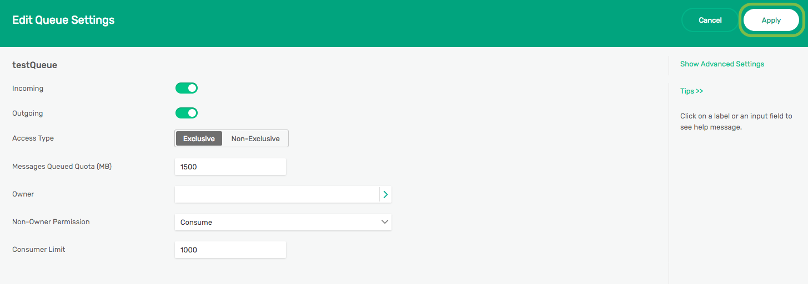

5. Your new queue will be displayed on the summary page. The queue is empty, so you will see zeros (0) in both the Messages Queued columns.

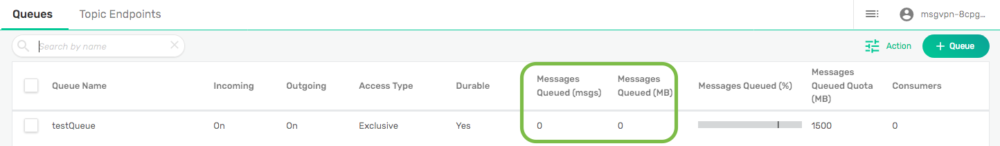

Step 3: Map a topic to queue
~~~~~~~~~~~~~~~~~~~~~~~~~~~~

While it is possible to publish directly to a queue by its name, it is common to map a topic to a queue for more flexibility. In this case, mapping a topic to a queue will allow us to use the Try Me! tab to publish a message to our queue to test it out.

To map a topic to a queue, follow the steps below.

1. From the queue summary, click anywhere in the row describing the queue to open the queue detail view.

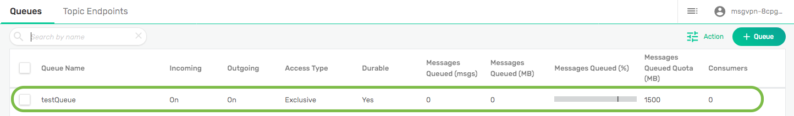

2. From the queue detail view, click on the **Subscriptions** tab.

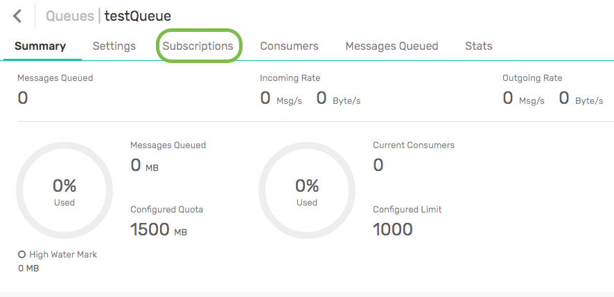

3. On the **Subscriptions** tab, click on the **+Subscription** button.

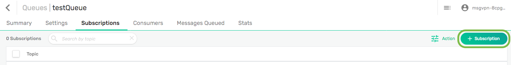

4. Enter the topic "try-me" as the subscription and click on the **Create** button. This is the default topic of the Try Me! tab.

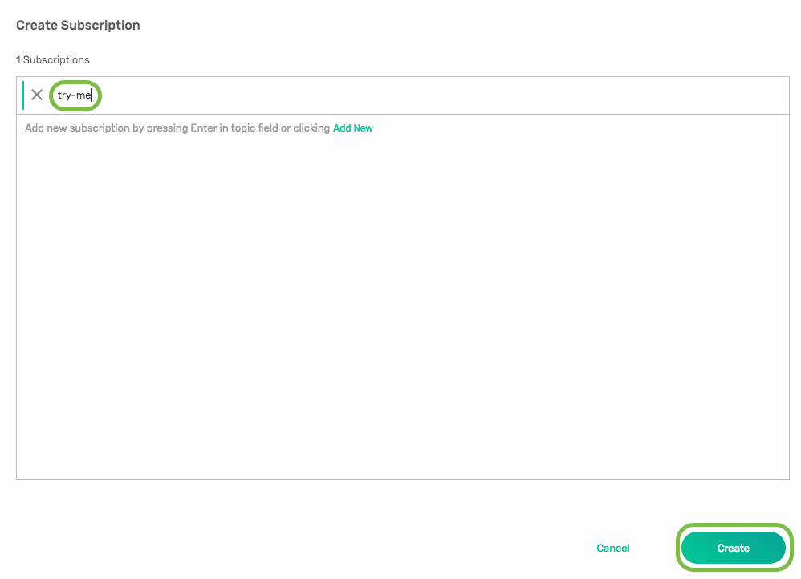

5. The topic "try-me" is now mapped to the queue. Messages published to that topic will go into the queue.

Step 4: Test the queue using the Try Me! tab
~~~~~~~~~~~~~~~~~~~~~~~~~~~~~~~~~~~~~~~~~~~~

We will use the publisher `CodePen <https://codepen.io/>`_ project on the Try Me! tab to publish a message into our queue. We are not going to use a subscriber connection.

To publish a message to the queue, follow the steps below.

1. Return to the main Solace Cloud browser tab and navigate to the **Try Me!** tab.

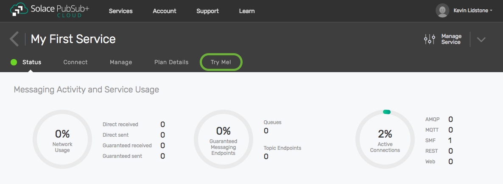

2. Click on the connect button under step 1 on the publisher CodePen.

.. raw:: html

    

3. Validate publisher connection.

.. raw:: html

    

4. Publish a message with **try-me** as the topic name under step 2 on the publisher CodePen.

.. raw:: html

    

Step 5: Confirm message is in the queue
~~~~~~~~~~~~~~~~~~~~~~~~~~~~~~~~~~~~~~~

We will use the Queue management tab to confirm that message we published in the previous step is now in the queue.

To publish a message to the queue, follow the steps below.

1. Return to the main service management browser tab and display the queue summary view by clicking on **Queues** in the left menu.

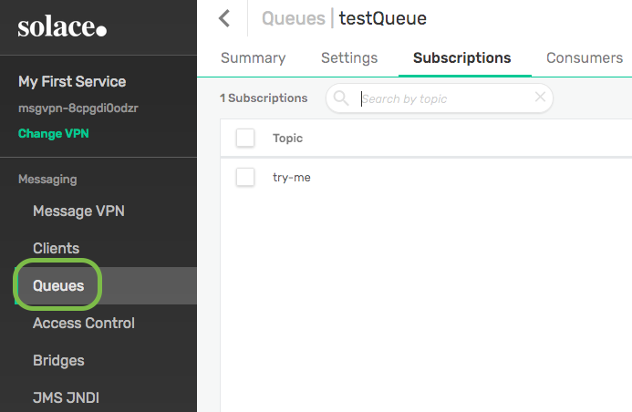

2. In the summary page, you will see your queue. The Messages Queued columns will now show 1 message in the queue with a non-zero value of bytes. Congrats, your queue is working correctly.

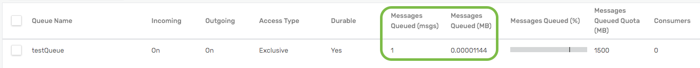

3. If you want to see more details about the message in the queue, click on anywhere in the row describing the queue and then navigate to the **Messages Queued** tab. For example, you can see the message ID assigned to the message and the time when it was published.

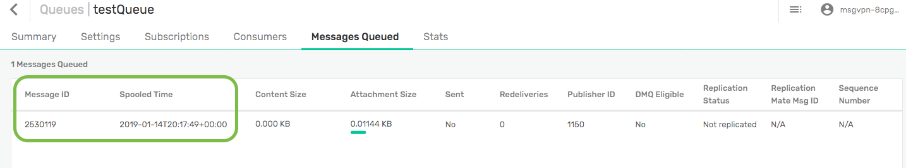

Step 6: Learn more
~~~~~~~~~~~~~~~~~~~~~~~~~~~~~~~~~~~~~~~~~~~~~~~~~~

Well done. You've now created a queue in your messaging service and published a message to it. Want to learn more?

* Try one of the API samples in GitHub, including samples on working with queues:
    * :doc:`Solace Messaging APIs <../group_quick_starts/gqs_using_messaging_apis>`.
    * :doc:`Open Messaging APIs <../group_quick_starts/gqs_using_open_apis>`.
* Learn how to manage your messaging service with our :doc:`REST Management APIs <../group_quick_starts/gqs_using_management_apis>`.
* Learn more about queues and `guaranteed messages <https://docs.solace.com/Features/Guaranteed-Messages.htm>`_.
