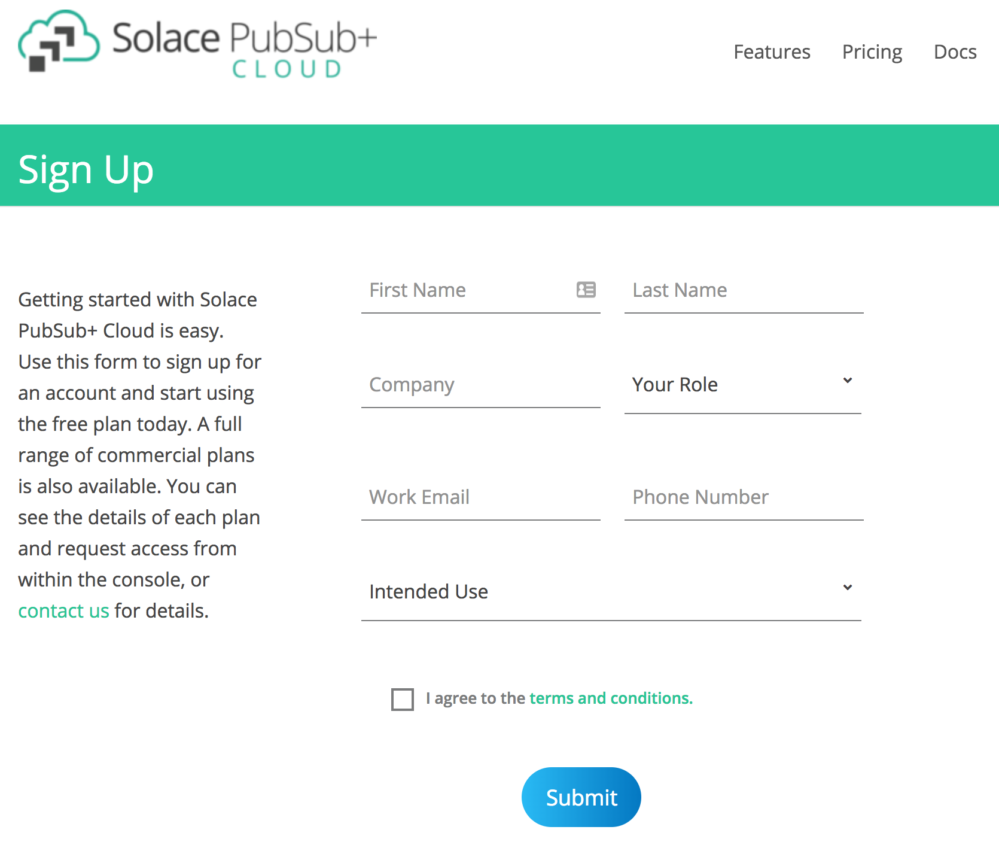
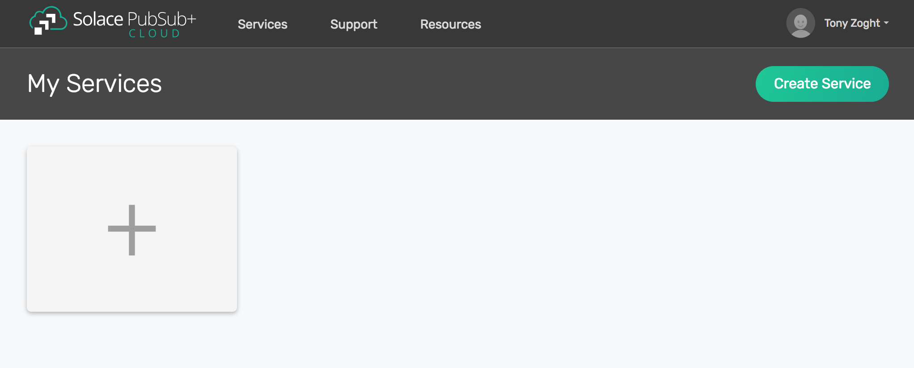
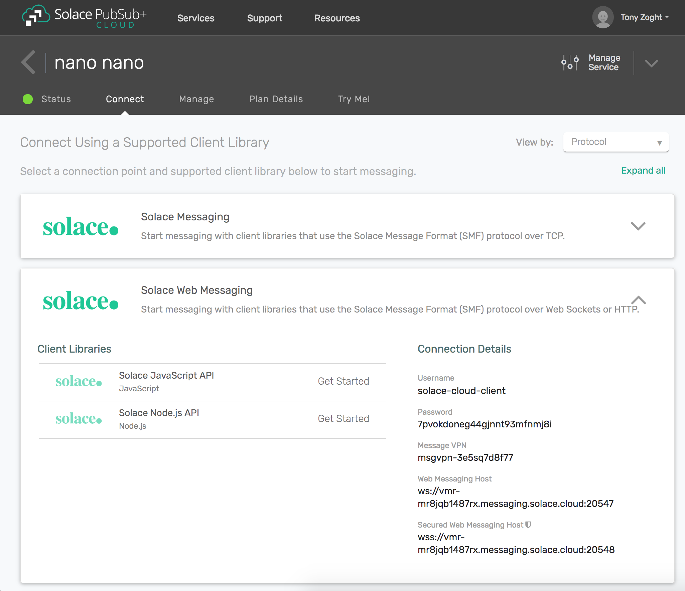
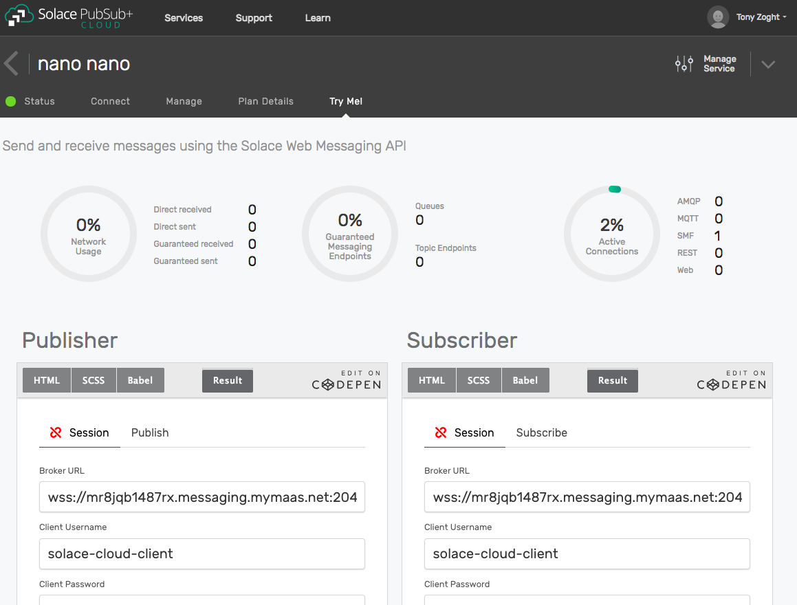

Creating your First Service
=============================

Solace Cloud is easy to use, enterprise-grade, messaging as a service.

This getting started page will show you how to get up and running with Solace Cloud. 

We will:
 1. go over the basics of messaging
 2. walk you through the simplest messaging example

If you are new to **Messaging**, you may wish to first read :doc:`../group_concepts/gc_messaging_concepts`. 

Otherwise, let's get started. You can skip any of the following steps if you're done it
already. This should not take more than **2 minutes** and will only need your browser.

Step 1: Sign up
~~~~~~~~~~~~~~~~~~~~~~~~~~~~~~

If you haven't yet signed up for Solace PubSub+ Cloud, `sign up <https://cloud.solace.com/signup/>`_ to create a **free** account.

Step 2: Sign in
~~~~~~~~~~~~~~~~~~~~~~~~~~~~~~~~~~~~~~~~~~~~

You should receive a confirmation email. If you can't find it, check your spam folder. Click the link to sign in to Solace PubSub+ Cloud.

Now, click on the big **plus sign +**, the **Create Service** button, or on the image below, to create a service.

   
Step 3: Try the Service
~~~~~~~~~~~~~~~~~~~~~~~~~~~~

On your service, click the Try Me! tab.

.. _RunInlineSample:
Step 4: Run the inline sample
~~~~~~~~~~~~~~~~~~~~~~~~~~~~~~~~

|

