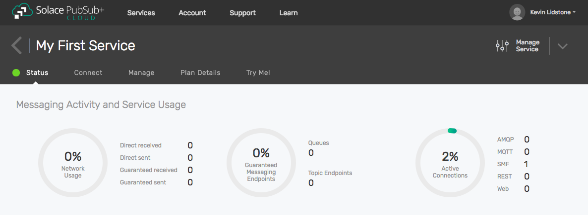

Creating Your First Messaging Service
======================================

To start integrating your applications with Solace PubSub+ Cloud, you must first create a messaging service. Once your messaging service is created, you can connect your applications with it
by using a client library compatible with the Solace PubSub+ message broker. This getting started tutorial will walk you through creating an account on Solace PubSub+ Cloud,
creating your first messaging service, and obtaining the connection information necessary to get your applications connected to Solace PubSub+ Cloud.

If you are new to **Messaging**, you may wish to first read :doc:`../group_concepts/gc_messaging_concepts`.

Otherwise, let's get started. You can skip to :ref:`step 2 <step2>`  if you already have an account. This should not take more than **2 minutes** and will only require a web browser.

Goals
~~~~~

The goal of this tutorial is to help you sign up for an account and create your first messaging service. This tutorial will show you:

* How to sign up for Solace PubSub+ Cloud.
* How to create a messaging service.
* How to find your messaging service’s connection information.

Step 1: Sign up for Solace PubSub+ Cloud
~~~~~~~~~~~~~~~~~~~~~~~~~~~~~~~~~~~~~~~~

To sign up for Solace PubSub+ Cloud, `click here <https://cloud.solace.com/signup/>`_ to create a **free** account. Click on the following video to view an example of
signing up.

.. raw:: html

    <video width="768" height="480" muted poster="../_static/img/signup_new.jpg" onclick="this.paused ? this.play() : this.pause();" style="cursor: pointer;">
        <source src="../_static/video/signup_new.webm">
    </video>

Once you have submitted your details, you will receive a confirmation email. By clicking the Activate button in the email, your PubSub+ Cloud account will be activated and
you will be directed into the PubSub+ Cloud Console.

.. raw:: html

    

.. _step2:

Step 2: Create a messaging service
~~~~~~~~~~~~~~~~~~~~~~~~~~~~~~~~~~~~~~~~~~~~

Once you have logged into the console, you will be brought to the My Services page. This page will show you all of the various messaging services you have created in Solace PubSub+ Cloud. To create your first messaging service, follow the steps below.

1. Press the Create Service button.
2. You must then select a **plan type**, enter a **service name**, and choose the **cloud provider and region** where you would like to create your messaging service.
3. For your first messaging service, select the **Free Plan** or **Nano** depending on your account setup. Solace PubSub+ Cloud gives you access to different plan types that will give various levels of messaging performance. By default, a new Solace PubSub+ Cloud account only has access to the free plan. Later on, you may request access to additional plans by selecting them and pressing the request access button.
4. Enter a messaging service name of **My First Service**. Messaging services are identified in the console by their name.
5. Press on the map and choose one of Solace PubSub+ Cloud's available providers and regions. If the region you prefer isn't available, you can contact Solace PubSub+ Cloud support and ask for your region to be supported. For your first messaging service, choose the region closest to where your application will run.
6. You can then complete the process by pressing the Start Service button.

To see these steps in action, watch the following video.

.. raw:: html

	<video class="video" width="768" height="480"  style="max-width: 700px;" muted controls>
		<source src="../_static/video/createservice.mp4" type="video/mp4">
	</video>

Step 3: Find your messaging service's connection information
~~~~~~~~~~~~~~~~~~~~~~~~~~~~~~~~~~~~~~~~~~~~~~~~~~~~~~~~~~~~

Once you've pressed the Start Service button, the console will transition to the Service Details page for your messaging service. It may take some time for your messaging service to be created in the
cloud, but once it is, you will see the status of your messaging service. The options you have when viewing your messaging service details are as follows:

- **Status**: View the overall status and health of your messaging service.
- **Connect**: Find the connection information for your messaging service by selecting your language or protocol of choice.
- **Manage**: Find the management options for your messaging service to perform tasks such as configuring queues or managing clients.
- **Plan Details**: View the details of the plan you created your messaging service with such as the cloud provider, region, and connection limits.
- **Try Me!**: Try your messaging service out using applications embedded from CodePen examples that allow you to publish and subscribe for messages on your messaging service.

Go to the Connect tab and choose the messaging protocol your application will be using. If you're not sure, you can also change the View By option to Language which allows you
to browse by the language your client application is written in. Select the client library you would like to use and the required connection information can be viewed for that
library. From here, you can explore more about your client library using the links under the learn more section.

.. raw:: html

    

	   </img>
       </img>
	

Step 4: Learn more
~~~~~~~~~~~~~~~~~~
Well done. You've now signed up and created your first messaging service. Want to learn more?

* Try exchanging some messages with your new messaging service with this next quick start :doc:`trying your messaging service <ggs_tryme>`.
