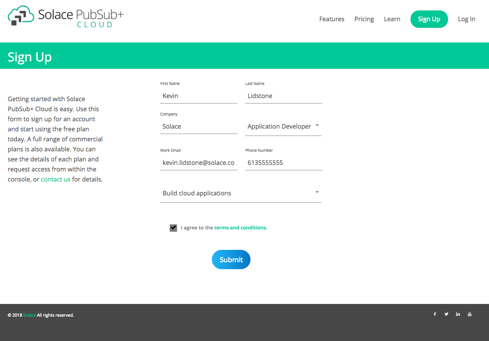
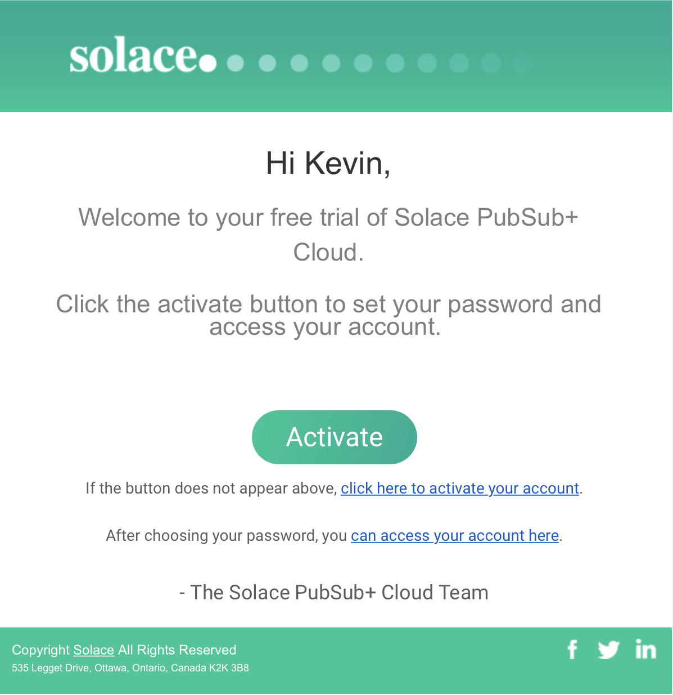

Creating Your First Messaging Service
=====================================

To start integrating your applications with Solace PubSub+ Cloud, you must first create a messaging service. Once your messaging service is created, you can connect your applications with it
by using a client library compatible with the Solace PubSub+ message broker. This getting started tutorial will walk you through creating an account on Solace PubSub+ Cloud,
creating your first messaging service, and obtaining the connection information necessary to get your applications connected to Solace PubSub+ Cloud.

If you are new to **Messaging**, you may wish to first read :doc:`../group_concepts/gc_messaging_concepts`.

Otherwise, let's get started. You can skip to `step 2`_  if you already have an account. This should not take more than **2 minutes** and will only require a web browser.

Goals
~~~~~~~~~~~~~~~~~~~~~~~~~~~~~~~~~~~~~~~~~~~~~~~~~~

The goal of this tutorial is to help you sign up for an account and create your first messaging service. This tutorial will show you:

* How to sign up for Solace PubSub+ Cloud.
* How to create a messaging service.
* How to find your messaging service’s connection information.

Step 1: Sign up for Solace PubSub+ Cloud
~~~~~~~~~~~~~~~~~~~~~~~~~~~~~~~~~~~~~~~~

To sign up for Solace PubSub+ Cloud, `click here <https://cloud.solace.com/signup/>`_ to create a **free** account. Click on the following video to view an example of
signing up.

Once you have submitted your details, you will receive a confirmation email. By clicking the Activate button in the email, you will be brought to the Solace PubsSub+ Cloud Console
where you must enter a password to activate your Solace PubSub+ Cloud account. Once activated, you will be automatically logged into the console.

.. _`step 2`:

Step 2: Create a messaging service
~~~~~~~~~~~~~~~~~~~~~~~~~~~~~~~~~~~~~~~~~~~~

**Tip:** When logged in you will be brought to the My Services page. This page will show you all the messaging services you have created in Solace PubSub+ Cloud. 

**Create your first messaging service**
1. Press the Create Service button.
2. You must then select a **plan type**
   **Tip:** For your first messaging service, select the **Free Plan** or **Nano** depending on your account setup.
3. Enter a **service name**
4. Choose the **cloud provider and region** for your messaging service by selecting the map and choosing from the available    providers and regions.
5. Enter a messaging service name of **My First Service**. 
6. Press the **Start Service** button to complete the process.
7.The service will be created and the Service Details page will be displayed. 
**Tip:** Solace PubSub+ Cloud gives you access to different plan types that will give various levels of messaging performance. By default, a new Solace PubSub+ Cloud account only has access to the free plan. Later on, you may request access to additional plans by selecting them and pressing the request access button.
**Tip:** If the region you prefer isn't available, you can contact Solace PubSub+ Cloud support and ask for your region to be supported. For your first messaging service, choose the region closest to where your application will run.

To see these steps in action, watch the following video.
.. raw:: html

	<video class="video" width="768" height="480" muted onclick="this.paused ? this.play() : this.pause();" controls>
		<source src="../_static/video/createservice.webm">
	</video>

Step 3: Find your messaging service's connection information
~~~~~~~~~~~~~~~~~~~~~~~~~~~~~~~~~~~~~~~~~~~~~~~~~~~~~~~~~~~~

Once the messaging service is created the Service Details page will be displayed.  Service details provided for the messaging service are as follows:
- **Status**: View the overall status and health of your messaging service.
- **Connect**: Find the connection information for your messaging service by selecting your language or protocol of choice.
- **Manage**: Find the management options for your messaging service to perform tasks such as configuring queues or managing clients.
- **Plan Details**: View the details of the plan you created your messaging service with such as the cloud provider, region, and connection limits.
- **Try Me!**: Try your messaging service out using applications embedded from CodePen examples that allow you to publish and subscribe for messages on your messaging service.

.. image:: ../img/service-detail.jpeg
    :height: 250px

**Get the messaging Service's Connection Information**
1. Go to the Connect tab 
2. Choose the messaging protocol your application will be using. 
3. The connection information for your messaging service will be provided.
4. From here, you can explore more about your client library using the links under the learn more section.
**Tip:** If you are unsure what messaging protocol you will be using you can also chang the View By option to Language.  This will allow you to select the client library that you would like to use.

.. raw:: html

    

	   </img>
       </img>
	

Step 4: Learn more
~~~~~~~~~~~~~~~~~~~~~~~~~~~~~~~~~~~~~~~~~~~~~~~~~~

Well done. You've now signed up and created your first messaging service. Want to learn more? 

* Try exchanging some messages with your new messaging service with this next quick start `trying your messaging service <ggs_tryme.html>`__.
