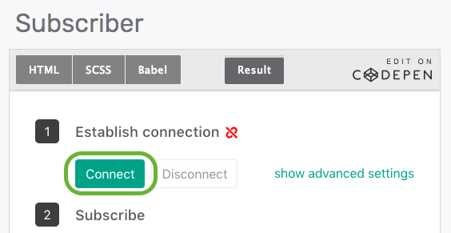
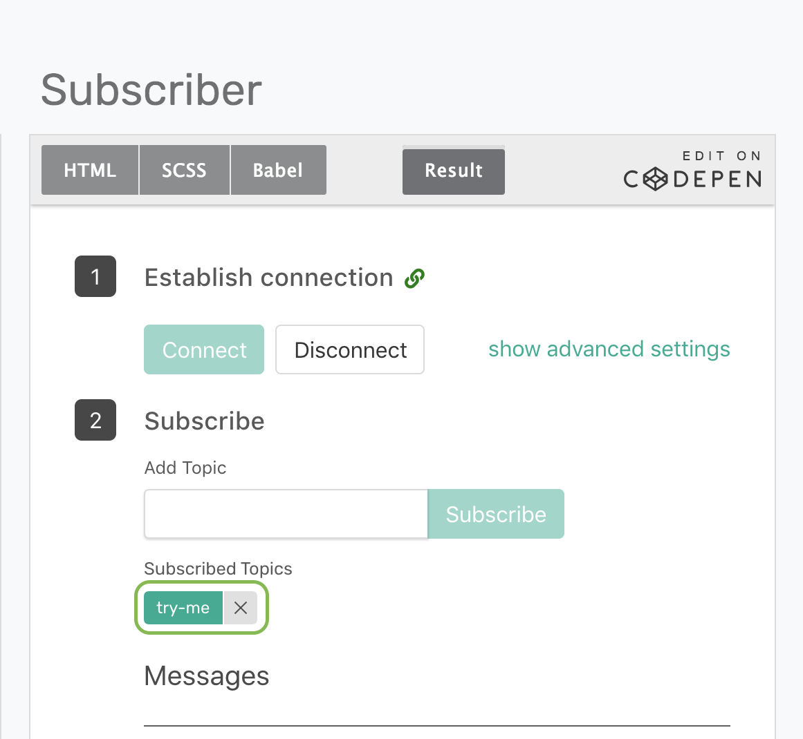
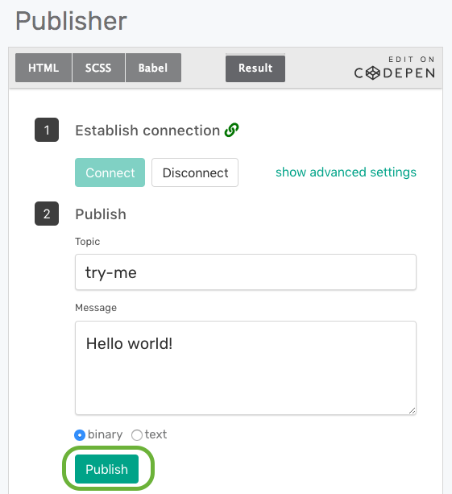

Trying Out Your Messaging Service
=================================

Goals
~~~~~~~~~~~~~~~~~~~~~~~~~~~~~~~~~~~~~~~~
The goal of this tutorial is to demonstrate the most basic messaging interaction using Solace messaging. This tutorial will show you:
1. How to connect a publisher and a subscriber to your service.
2. How to subscribing to a topic.
3. How to publish a message to the matching topic.

Pre-Requisites
~~~~~~~~~~~~~~~~~~~~~~~~~~~~~~~~~~~~~~~~
1.`Sign up for Solace PubSub+ Cloud<ggs_signup.html#step-1-sign-up-for-solace-pubsub-cloud>`__.
2.`Create a messaging service <ggs_signup.html>`__

Step 1: Go to the try me tool 
~~~~~~~~~~~~~~~~~~~~~~~~~~~~~~~~~~~~~~~~
**Go to the try me tab.**
1. `Login to Solace PubSub+ Cloud <https://cloud.solace.com/login/>`_
2. Click **Services** link at the top of the page
3. Select your service `that you created <ggs_signup.html>`__
3. Click the  **Try Me!** tab.

.. image:: ../img/tryMe_1.png

The Try Me tab has a JavaScript applications that can connect from your browser to your PubSub + Cloud service and exchange messages.
The try me tab is divided into the following sections.

* Donut charts at the top representing your messaging service metrics such as network usage, guaranteed messaging endpoints and the number of active connections.
* Two code pen projects: publisher and subscriber. 

.. image:: ../img/tryMe_2.png
    :width: 600px

Step 2: Connect publisher and subscriber
~~~~~~~~~~~~~~~~~~~~~~~~~~~~~~~~~~~~~~~~~~~~
**Connect a publisher and a subscriber to your service.**
1. Click on the **Connect** button under step 1 on the publisher codepen.

2. Click on the **Connect** button under step 1 on the subscriber codepen.

3. The publisher and subscriber are connected.
.. image:: ../img/tryMe_5.png
    :width: 700px

4. Optionally: Select the **show advanced settings** option to see the credentials that were used to connect. 
   -These credentials for your service are found on the 'Connect' tab. 

Step 3: Subscribe to a topic
~~~~~~~~~~~~~~~~~~~~~~~~~~~~~~~~~~~~~~~~~~~~~~~~~~
**Subscribe to the try-me topic**
1. In the Subscriber window enter **try-me** in the **Add Topic**
2. Select the **Subscribe** button
3. The try-me topic has been added to the subscription list
4. Optionally: Try other topics. `Click here <https://docs.solace.com/Features/Topic-Support-and-Syntax.htm>`_  to learn more about topics.

Step 4: Publish and Receive messages
~~~~~~~~~~~~~~~~~~~~~~~~~~~~~~~~~~~~~~~~~~~~~~~~~~
**Publish a message to the try-me topic**
1. In the Publisher window enter **try-me** in the **Topic**
2. Enter text into the **Message**
3. Select the **Publish** button to publish a message with the try-me topic

4. The message is e received by your codepen.
.. image:: ../img/tryMe_8.png
    :width: 600px

Step 6: Learn more
~~~~~~~~~~~~~~~~~~~~~~~~~~~~~~~~~~~~~~~~~~~~~~~~~~

Well done. You've now exchanged with your messaging service. Want to learn more? 

* Try one of the API samples in GitHub:
    * `Solace Messaging APIs <../group_quick_starts/gqs_using_messaging_apis.html>`__.
    * `open Messaging  APIs <../group_quick_starts/gqs_using_open_apis.html>`__.
* Learn how to manage your messaging service with our `REST Management APIs <../group_quick_starts/gqs_using_management_apis.html>`__.
* Learn more about `topic hierarchy <https://docs.solace.com/Features/Topic-Support-and-Syntax.htm>`_.
