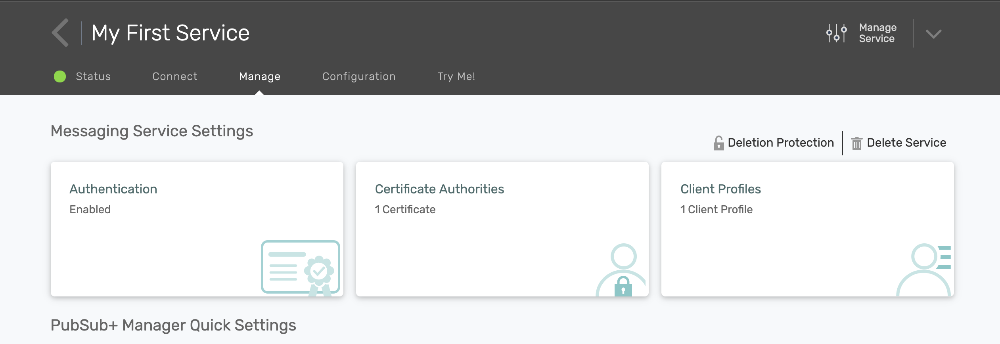
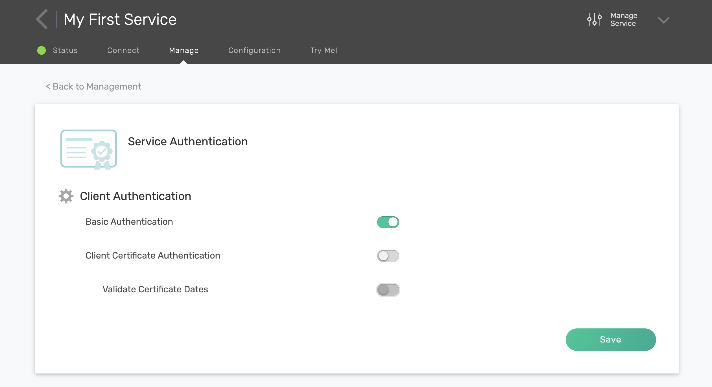
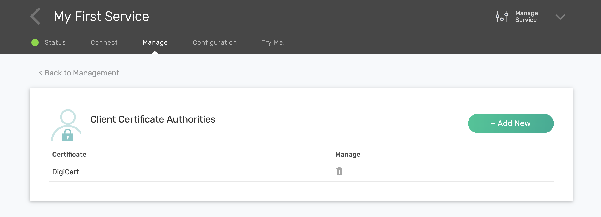

How to Configure Authentication
================================

You can manage messaging services authentication with PubSub+ Cloud. 

PubSub+ Cloud allows microservices to connect to your messaging service with Basic Authentication, and Client-Certificate Authentication.

- Note: Client-Certificate Authentication is only supported on Enterprise Plans (Kilo, Giga, Mega and Tera)

Configure Basic Authentication:
~~~~~~~~~~~~~~~~~~~~~~~~~~~~~~~~

- Note: Basic Authentication is the default setting for a PubSub+ Cloud service.

1. Go to your messaging services page by selecting Services from the top navigation bar.
2. Select your messaging service to navigate to messaging service details.
3. On the service details page, navigate to the Management tab.

4. Click on Authentication.

5. Toggle Basic Authentication, and click Save.

- Note: If you disable Basic Authentication then an error will be showing stating 'You have authentication disabled. Your messaging service is accessible by everyone.' This is not recommended.

Configure Client Certification (Enterprise Plans only):
~~~~~~~~~~~~~~~~~~~~~~~~~~~~~~~~~~~~~~~~~~~~~~~~~~~~~~~~

1. Go to your messaging services page by selecting Services from the top navigation bar.
2. Select your messaging service to navigate to messaging service details.
3. On the service details page, navigate to the Management tab.
4. Click on Authentication.
5. Toggle Client Certificate Authentication.
6. Toggle Validate Certificate Dates.
7. Click Save.

Configure Certificate Authority (Enterprise Plans only):
~~~~~~~~~~~~~~~~~~~~~~~~~~~~~~~~~~~~~~~~~~~~~~~~~~~~~~~~~

By default a certificate called DigiCert is provided for Enterprise Plans. You may choose to secure your client connections with that certificate or upload your own certificate.

1. Go to your messaging services page by selecting **Services** from the top navigation bar.
2. Select your messaging service to navigate to messaging service details.
3. On the service details page, navigate to the Management tab.
4. Click on Authentication.
5. Click on Certificate Authority tab.

6. Upload your cerificate of choice. You may also delete cerificates as well.

To enable your applications to use client-certificates please see `Defining Client Authentication Info <https://docs.solace.com/Solace-PubSub-Messaging-APIs/Developer-Guide/Defining-Client-Authentication.htm>`_.
