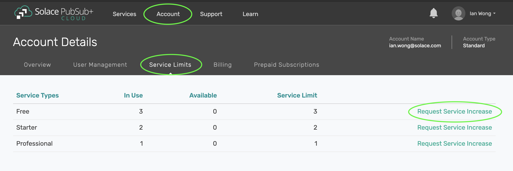
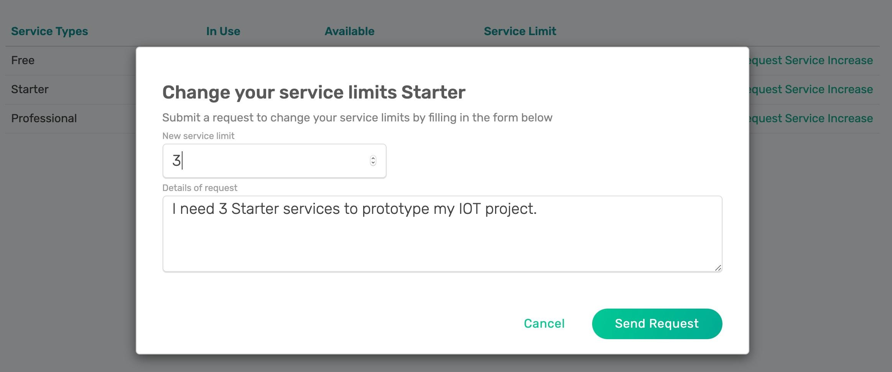

How to Increase Your Capacity or Number of Services
====================================================

The number of services you can create is limited by the service limits set in your organization. Users with Basic accounts without credit card billing set up are only able to create Free service types. For Basic account users with credit card billing enabled or Enterprise users, your organization is limited in the number of services that can be created. These limits can be changed upon request.

Requesting a Service Limit Increase from PubSub+ Cloud Console
---------------------------------------------------------------

1. Login into `Solace Cloud <https://console.solace.cloud/login>`_ 

2. Click Account on the top menu, and the Service Limits tab under Account Details

3. On the service limit table, you can click on "Request Service Increase" for each plan of interest.

:target: https://console.solace.cloud/account-details/service-limits

4. A dialog box will then show up, you may then specify the number of services you require, and any comments in the details of the request.
Click on "Send Request".

Our product support team will follow up after receiving your request.

