How to Connect using Client Certificate Authentication
======================================================

When establishing a secure connection to your messaging service, the client will validate that the certificate of the messaging service (the server certificate) is signed by a trusted certificate authority. The server certificate, once validated, confirms the identity of the server.

Your messaging service uses a server certificate that is signed by a highly trusted public certificate authority and will be trusted in many environments (ex. browsers, Java Virtual Machine). For greater security, the client can also use a certificate to prove its identity. When the client connects, the server will validate that the certificate of the client is signed by a trusted certificate authority. This is called mutual or two-way authentication.

Messaging services on Enterprise Plans (Kilo, Giga, Mega and Tera) support client-certificate based authentication. This tutorial will walk you through the steps of using client certificate authentication. It will use an MQTT client because MQTT is often used in IoT environments and client certificate authentication is common for IoT devices.

While it is possible to use client certificates signed by a public certificate authority, organizations often set up a private certificate authority to issue client certificates. Certificates signed by a public certificate authority are expensive and are generally unnecessary. You only require a publicly signed certificate if you want to allow clients from the public to connect to your messaging service. That is typically not the case, so a private certificate authority is suitable. A private certificate authority is also potentially more secure, since the organization controls the entire certificate issuing process.

The tutorial will use widely available `OpenSSL tools <https://www.openssl.org/>`_  to create a private certificate authority that will be used to sign the client certificates. It will also use the `MQTT.fx tool <https://mqttfx.jensd.de/>`_ to demonstrate connecting an MQTT client using that client certificate. The MQTT.fx tool is open source and can be downloaded `here <https://mqttfx.jensd.de/index.php/download>`_. Packages are available for Linux, Windows, and Mac.

Goals
~~~~~
The goal of this tutorial is to demonstrate how to connect an MQTT client to your messaging service using client certificate authentication. This tutorial will show you:

* How to create a private certificate authority
* How to generate a client certificate and sign it
* How to configure client certificate authentication
* How to upload a certificate to the certificate authority list
* How to create a client username that matches a client certificate
* How to connect an MQTT client using client-certificate authentication

Prerequisites
~~~~~~~~~~~~~

Before starting this tutorial make sure you have:

* A messaging service on an Enterprise Plan (Kilo, Giga, Mega and Tera)
* OpenSSL tools installed
* MQTT.fx tool installed

Step 1: Create a Private Certificate Authority
~~~~~~~~~~~~~~~~~~~~~~~~~~~~~~~~~~~~~~~~~~~~~~

To create a private certificate authority (CA), we will use OpenSSL, which is included with most Linux-based operating systems and can be easily installed if it is not available. For details on installing OpenSSL, go `here <https://wiki.openssl.org/index.php/Binaries>`__.

To create a private CA, follow the steps below.

1. Generate a private key and a public certificate for the CA. The command below will generate two files, one for the private key and one for the public certificate.  The certificate will have a common name of \*.messaging.solace.cloud. It is specified as part of the **-subj** parameter in the command line. If you would prefer to enter the common name and the other values interactively, omit the **-subj** parameter.
::

    openssl req -newkey rsa:2048 -nodes -keyout MyRootCaKey.key -x509 -days 365 -out MyRootCaCert.pem -subj "/C=GB/ST=London/L=London/O=Global Security/OU=IT Department/CN=*.messaging.solace.cloud"

The private key file and the public certificate file are all you need for your private certificate authority. Make sure you store the private key file (MyRootCaKey.key) in a safe place. The certificate is public and will be uploaded to the messaging service later.

Step 2: Create a Client Certificate
~~~~~~~~~~~~~~~~~~~~~~~~~~~~~~~~~~~

Once the private CA files are created, follow the steps below to create a client certificate and sign it.

1. Create a private key for the client. The client private key file (client1.key) will be needed when the client connects to the messaging service. Keep this file secure.
::

    openssl genrsa -out client1.key 2048

2. Create a certificate signing request (CSR) for the client. The common name for the client certficate will be client1.messaging.solace.cloud. The common name is important since it will be used to identify the client. As before, you can omit the **-subj** parameter to add the common name interactively.
::

    openssl req -new -key client1.key -out MyClient1.csr -subj "/C=GB/ST=London/L=London/O=Global Security/OU=IT Department/CN=client1.messaging.solace.cloud"

3. Issue the client certificate using the private CA key and certificate created in the previous step. The certificate will be valid for 1 year.
::

    openssl x509 -req -in MyClient1.csr -CA MyRootCaCert.pem -CAkey MyRootCaKey.key -CAcreateserial -out clientCert1.pem -days 365 -sha256

The following files created during this step need to be accessible by the client:

* client1.key. This is the private key for the client. Keep this file safe.
* clientCert1.pem. This is the client certificate which has been signed by our private CA. It will be used to authenticate the client with the messaging service.

Step 3: Enable Client Certificate Authentication
~~~~~~~~~~~~~~~~~~~~~~~~~~~~~~~~~~~~~~~~~~~~~~~~

Now that we have a signed certificate for the client, we can enable client certificate authentication for our messaging service. By default, the messaging service has basic authentication enabled, which allows authentication using a username and password. We will leave this enabled so that the existing usernames and passwords for your service will still work.

**Note:** You can only configure client certificate authentication for services on Enterprise Plans (Kilo, Giga, Mega and Tera).

To enable client certificate authentication, follow the steps below.

1. Go to your messaging services page by selecting Services from the top navigation bar.
2. Select your messaging service to navigate to messaging service details.
3. On the service details page, navigate to the **Management** tab.

.. image:: ../img/ggs_queue_mgmt_menu.png

4. Click on the **Authentication** tile. This tile will only appear for services on Enterprise plans.

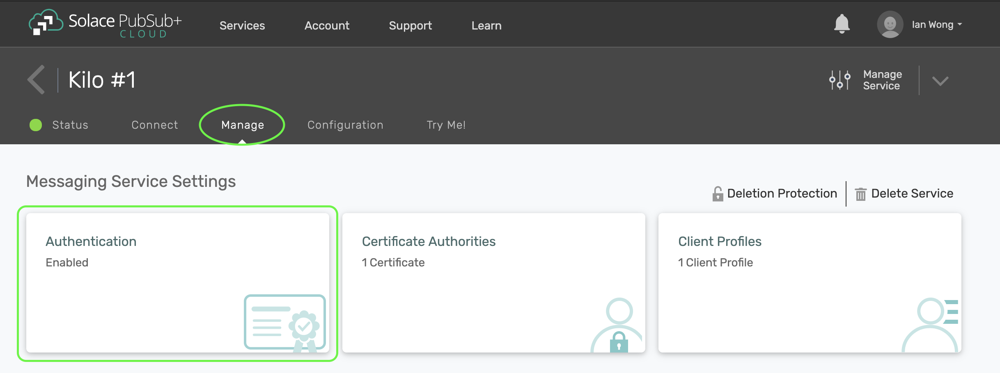

5. Toggle on **Client Certificate Authentication**. It is recommended that you also toggle on **Validate Certificate Dates** so the the messaging service will also check the client certificate has not expired.

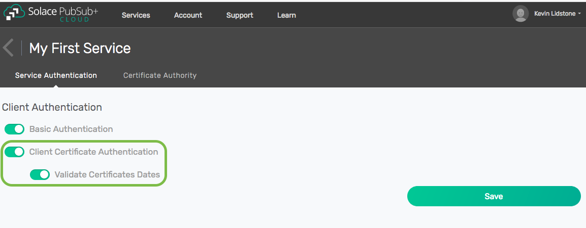

6. Click on **Save** to save the configuration change.

Step 4: Upload the Certificate for the Private CA
~~~~~~~~~~~~~~~~~~~~~~~~~~~~~~~~~~~~~~~~~~~~~~~~~

Now that we have enabled client certificate authentication, we need to make sure client certificates signed by our private CA are  trusted by the messaging service. To do that, we need upload the certificate from the private CA we created in step 1 to the list of certificates authorities trusted by our messaging service.

**Note:** You can only configure new certicate authorities for services on Enterprise Plans (Kilo, Giga, Mega and Tera).

To upload a certificate for a trusted certificate authority, follow the steps below.

1. Navigate the **Certificate Authority** tab and click on **+ Certificate**. Note that the certificate for the public CA for our messaging service will already be listed as a trusted certificate authority. (This allows messaging services to securely connect to each other when enabling Dynamic Message Routing.)

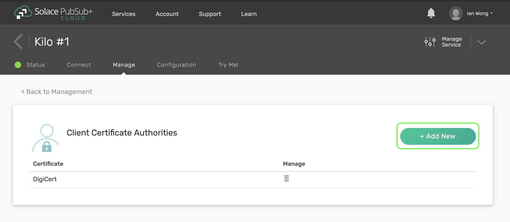

2. Enter a name for the CA certificate. The name cannot contains spaces or special characters.

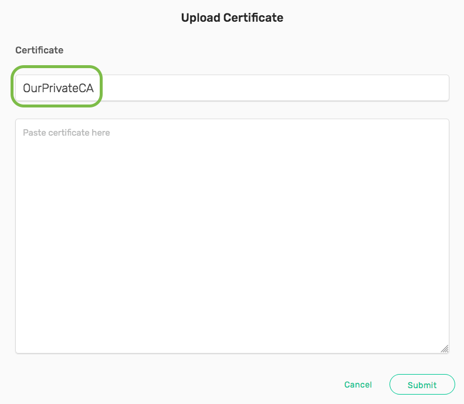

3. Open the public certificate (MyRootCaCert.pem) for the private CA created in step 1 in a text editor. Copy the all the text in the certificate file, including the BEGIN CERTIFICATE and END CERTIFICATE lines.

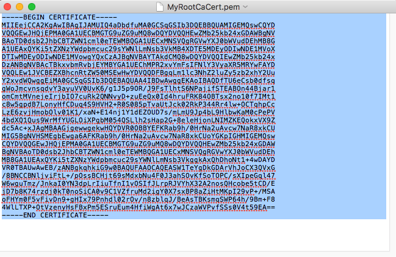

4. Paste the certificate text into the **Paste certificate here** text box in **Upload Certificate** dialog box.

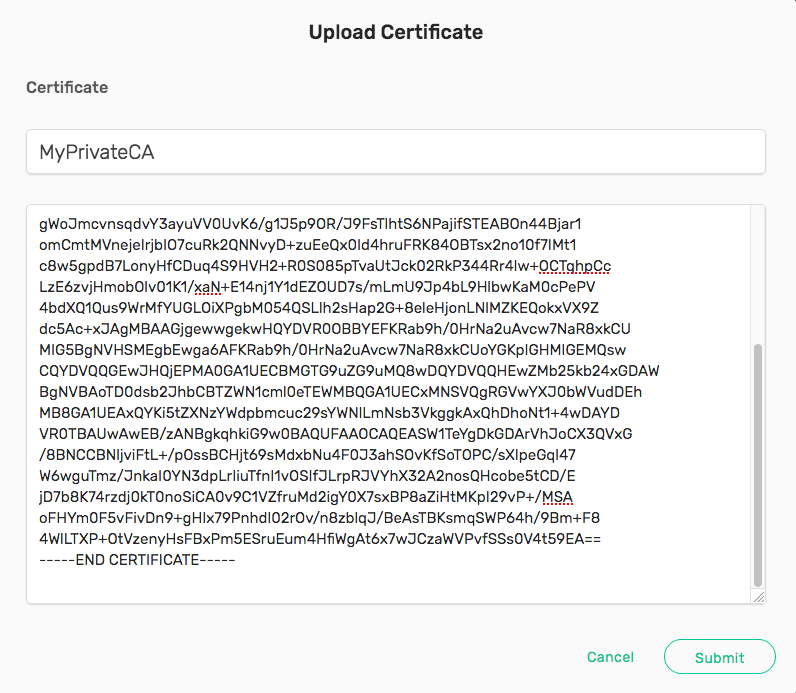

5. Click on **Submit**. Once the certificate has been uploaded, click on **OK**.

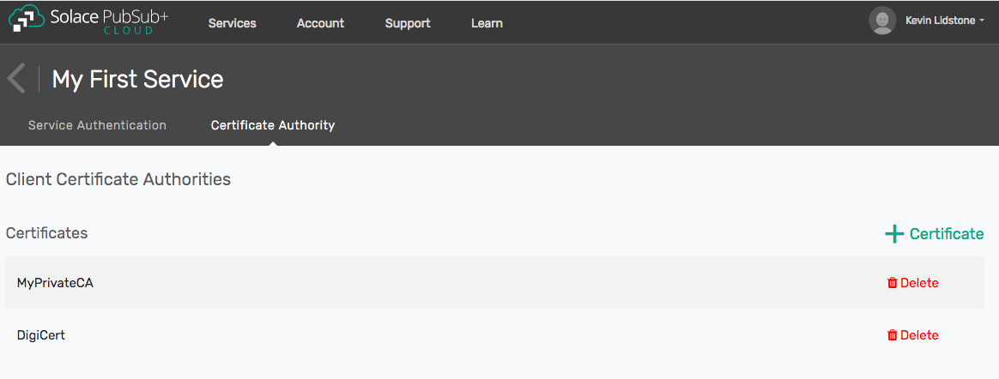

Step 5: Add Client Username for Client Certificate
~~~~~~~~~~~~~~~~~~~~~~~~~~~~~~~~~~~~~~~~~~~~~~~~~~

Now that our private CA has been added as a certificate authority, the messaging service will trust the client certificate we created. The client certificate establishes the identity of the client, which is represented by the common name in our client certificate (client1.messaging.solace.cloud). We must configure our messaging service to allow a client with this identity to access our service. This is done by adding a client username that matches the common name of our client certificate.

To create a client username, follow the steps below.

1. Click on the back arrow to go to the service details page.

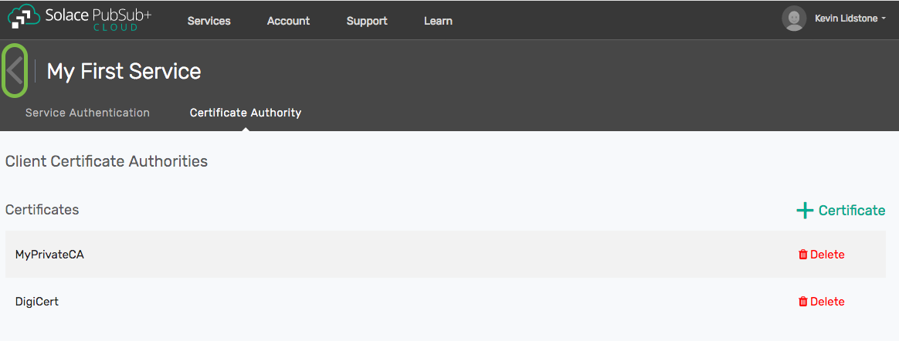

2. Click on the **Manage Service** button near the top right. This will open the service management window in a new browser tab.

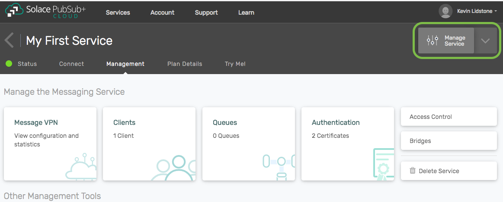

3. In the new browser tab, click on **Access Control** in the left menu.

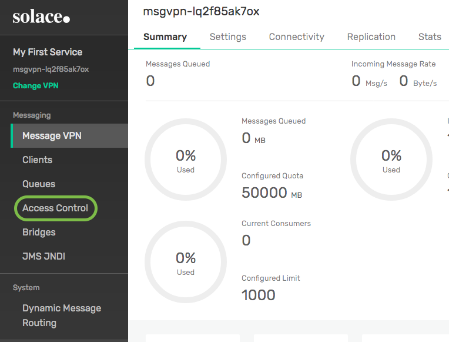

4. Click on the **Client Username** tab.

.. image:: ../img/ght_cert_client_usernames.png

5. Click on **+ Client Username** to add a client username.

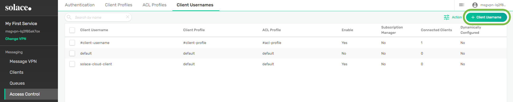

6. Enter the common name from the client certificate, client1.messaging.solace.cloud, and click on **Create**.

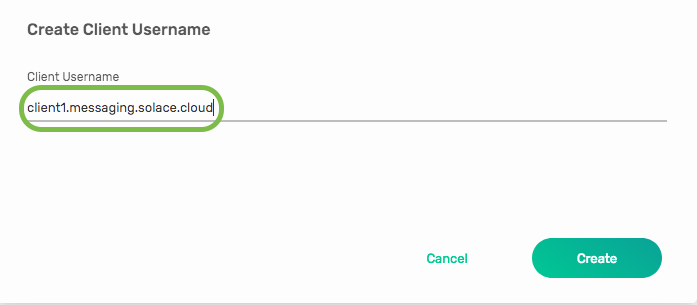

7. Toggle on **Enable** and click on **Apply**. The client username is created and enabled.

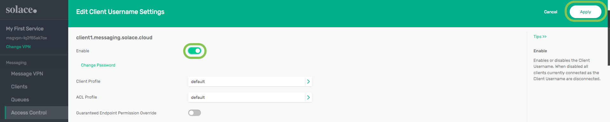

Step 6: Gather Details for Connecting an MQTT Client
~~~~~~~~~~~~~~~~~~~~~~~~~~~~~~~~~~~~~~~~~~~~~~~~~~~~

The messaging service is now configured to authenticate a client using the client certificate we created in step 2. Before we can connect an MQTT client we need to gather some connectino details from our service. We need to know the host name and secure MQTT port for our service. We also need the certificate for the public CA used by the messaging service so that the client can validate our server certificate.

**Note:** The certificate for the public CA is not needed in all cases. The CA certificate used to sign the server certificate is highly trusted and installed in most default trust stores. However, not all clients have access to a default trust store, especially IoT client which may be running in a minimally configured environment. The MQTT.fx tool that we will use in the next step requires that we specify the root CA certificate when using client certificates. If we were not using client certificates, the MQTT.fx tool would trust our server certificate (using the **CA signed server certificate** setting).

To gather connection information for an MQTT client, follow the steps below.

1. From the service details page, click on the **Connect** tab.

2. Click on the **MQTT** tile to expand it.

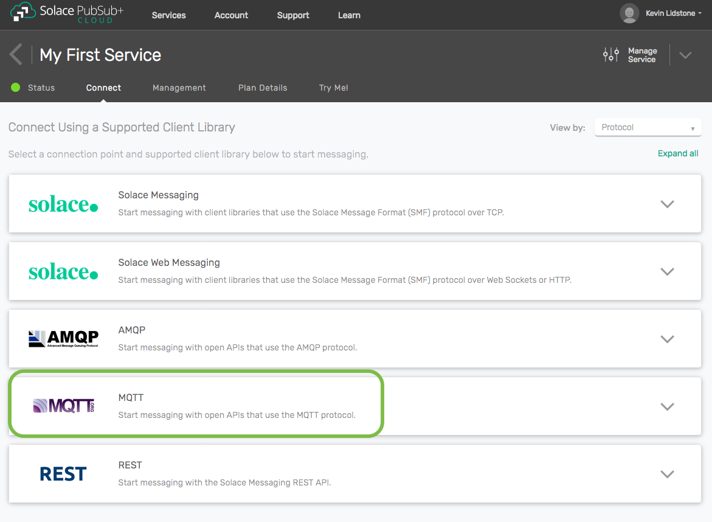

3. In the **Connections Details** column, record the value for the **Secured MQTT Host**. This includes the host name and port for the secure MQTT connection in URL format.

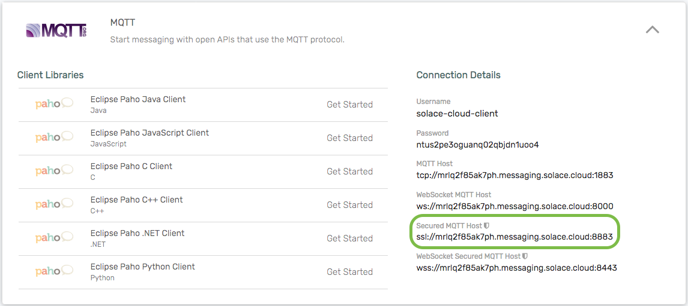

4. At the top of the page, click on the **Solace Messaging** tile to expand it.

5. Right-click on the **Download PEM** link and save the file. Record the location of this file. This is the certificate for the public CA.

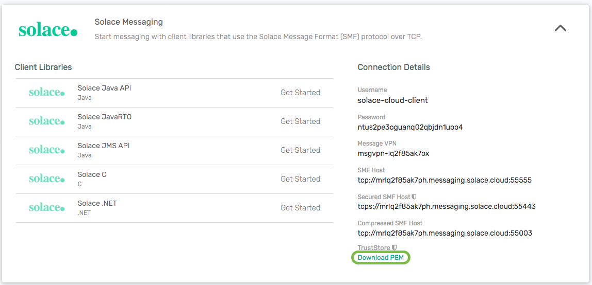

Step 7: Connect an MQTT Client using the Client Certificate
~~~~~~~~~~~~~~~~~~~~~~~~~~~~~~~~~~~~~~~~~~~~~~~~~~~~~~~~~~~

The messaging service is configured to authenticate a client using the client certificate we created in step 2. We will now using the MQTT.fx tool to connect an MQTT client to our service using a client certificate. If you haven't already, you can download the MQTT.fx tool from `here <https://mqttfx.jensd.de/>`__.

To connect an MQTT client, follow the steps below.

1. Start the MQTT.fx tool.

2. Click on the settings icon in the top bar, near the middle.

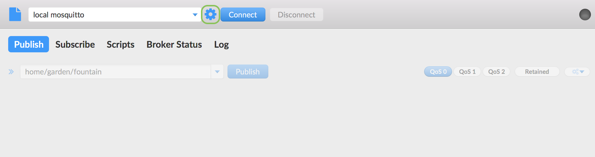

3. In the **MQTT Broker Profile Settings** section, enter the host value from the connection details in the **Broker Address** and the port value in the **Broker Port** (typically 8883). Click on the **Generate** button to generate a random client ID.

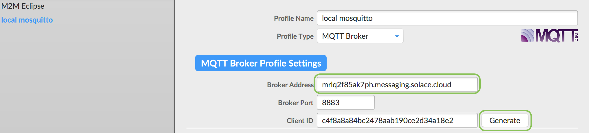

4. Click on the **SSL/TLS** tab underneath the **MQTT Broker Profile Settings** section. Click on **Enable SSL/TLS**, then click on the **Self signed certificates** radio button.

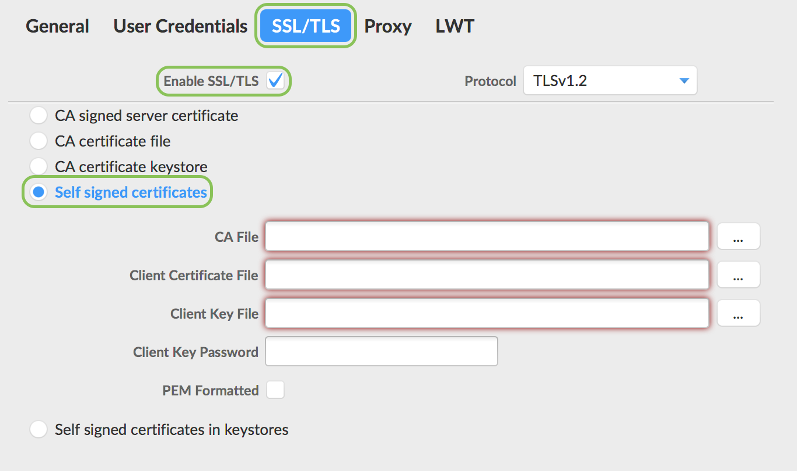

5. In the **CA File** field enter the path to the public CA certificate you downloaded in the previous step. In the **Client Certificate File** field, enter the path to the client certificate you created in step 2. In the **Client Key File** field, enter the path to the client key you created in step 2. Select the **PEM Formatted** checkbox since all files are in PEM format.

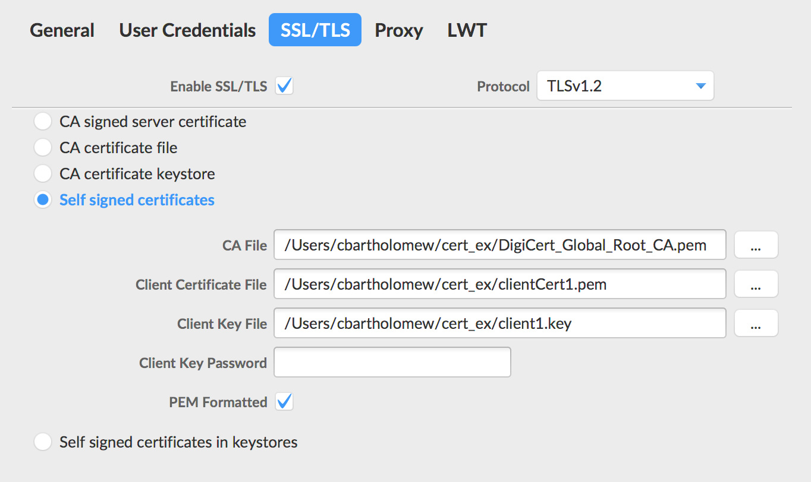

6. Click on **OK**.

7. Click on the **Connect** button in top bar beside the settings icon to connect the MQTT client to the messaging service using the client certificate.

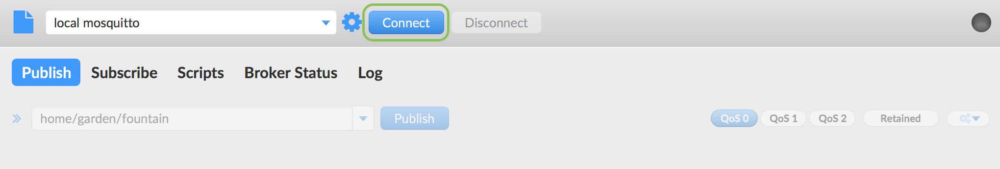

8. When the client is successfully connected, the circular indicator in the top right turns green. Since the client is encrypted, a padlock icon also appears.

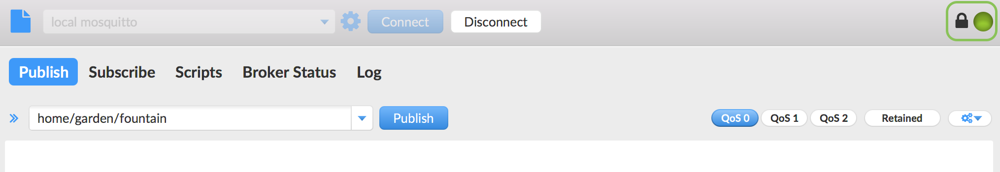

9. You can use the MQTT.fx tool to publish and subscribe using the MQTT connection.

Step 8: Learn more
~~~~~~~~~~~~~~~~~~~~~~~~~~~~~~~~~~~~~~~~~~~~~~~~~~

Congratulations! You've done a lot in this tutorial. You created a private certificate authority, generated a client certificate, configured your messaging service to authenticate using that client certificate, and connected an MQTT client with mutual (two-way) authentication.  Still haven't learned enough and want to learn more?

* Try one of the API samples in GitHub, including samples on working with queues:
    * :doc:`Solace Messaging APIs <../group_quick_starts/gqs_using_messaging_apis>`.
    * :doc:`Open Messaging APIs <../group_quick_starts/gqs_using_open_apis>`.
* Learn how to manage your messaging service with our :doc:`REST Management APIs <../group_quick_starts/gqs_using_management_apis>`.
* Learn more about `client authentication <https://docs.solace.com/Features/Client-Authentication.htm>`_.
