How to Create an Event Mesh in PubSub+ Cloud
============================================

An Event Mesh is a configurable and dynamic infrastructure layer for distributing events among decoupled applications,
cloud services and devices. `Click here <https://solace.com/what-is-an-event-mesh>`_ to learn more about what an Event Mesh is.

The Event Mesh feature in PubSub+ Cloud is in an Alpha state. Once fully developed, you will be able to use this feature to view, define, create, and manage an Event Mesh that fits your needs.

With this release, you can:

- See where all your data centers are on a map
- View the potential associations that would be used to create a mesh
- Plan how your mesh can be constructed to solve your business problems
- See the appropriate details of a service that helps you define an Event Mesh
- As this is an Alpha release, we’d love to get your feedback. You will find a ‘feedback’ control in the bottom left of the screen which you can use to let us know what you think.

Creating an Event Mesh
----------------------

To create an Event Mesh, start by creating multiple enterprise messaging services to bridge together into an Event Mesh. Note that the messaging service must use a plan type of
Kilo, Mega, Giga or Tera else it will not be eligible for Dynamic Message Routing and not be able to be used in an Event Mesh. After you have your messaging services, you can begin creating an Event Mesh.
Note that you only see datacenters on the Event Mesh map in which you have valid messaging services with DMR enabled.

1. Navigate to the **Event Mesh** tab.
2. Press the **Create Event Mesh** button.

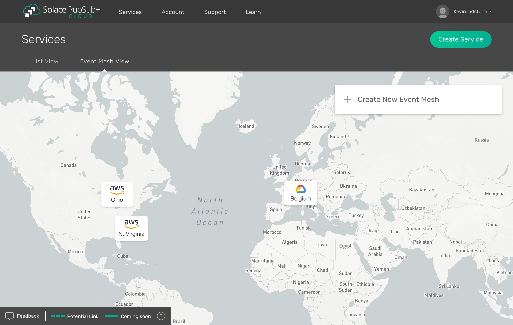

3. Enter an Event Mesh name and optionally choose a color for your links to be displayed in.

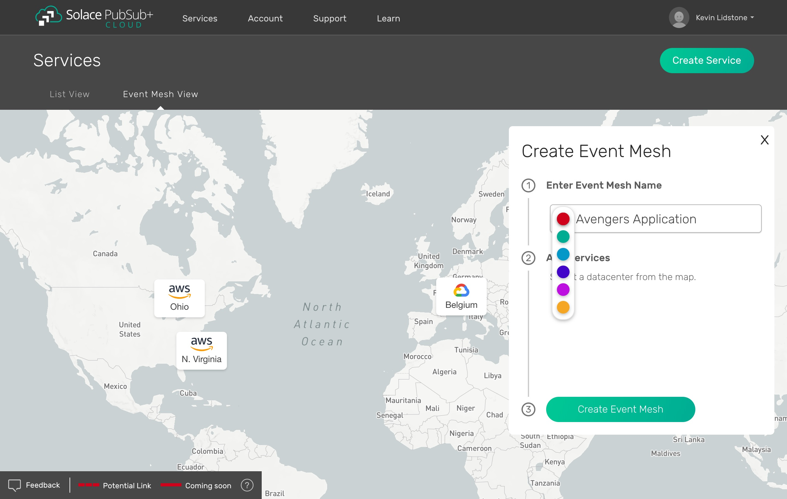

4. Select your services that you want to partake in the Event Mesh by selecting the datacenter from the map, then selecting the service tile. Repeat as necessary.

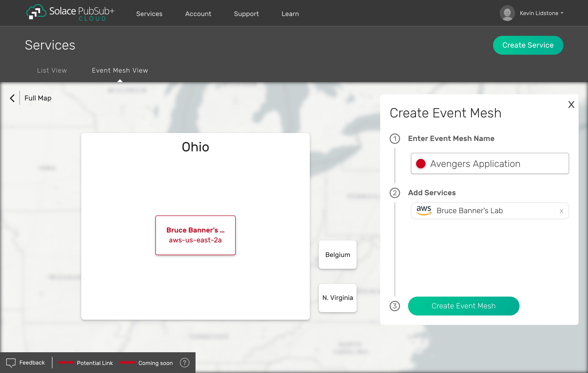

5. Press the green **Create Event Mesh** button.

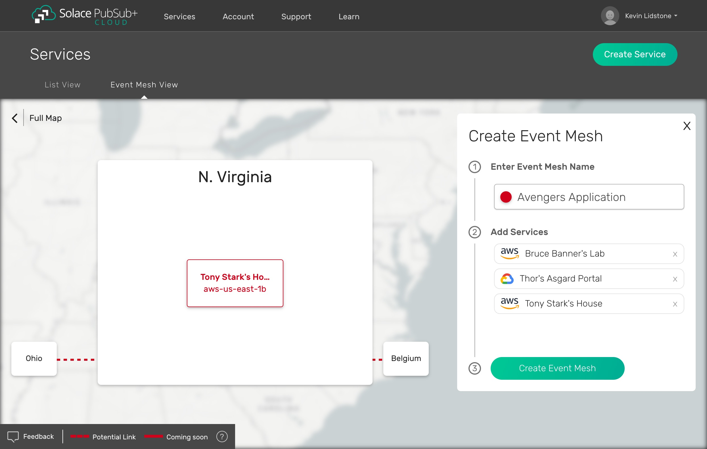

6. Visualize your Event Mesh in the map.

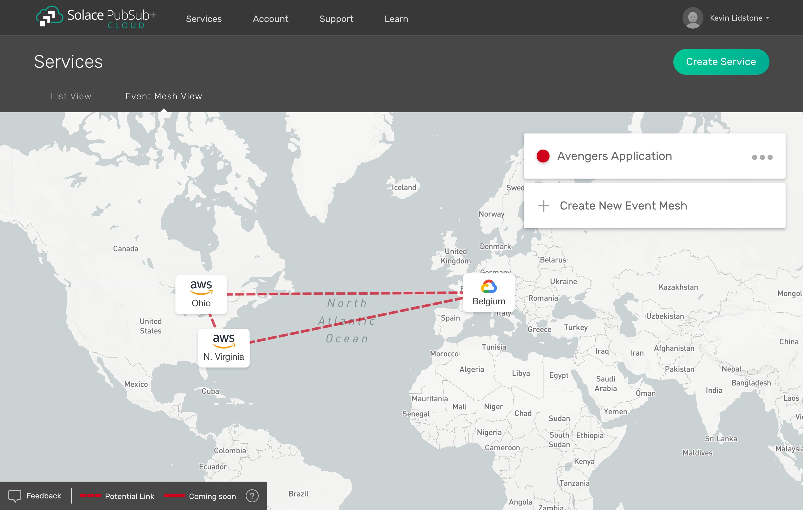

Congratulations, you have succesfully created your first Event Mesh! Next, follow the steps below to turn your Event Mesh visualization into a true Event Mesh.

Configuring DMR for PubSub+ Cloud Services via the PubSub+ Manager
------------------------------------------------------------------

By configuring Dynamic Message Routing (DMR) for PubSub+ Cloud messaging services, you can realize your Event Mesh, allowing you to publish messages to one messaging service
and receive the messages in another where you have a matching subscription. Follow the steps below to make it happen.

1. While viewing your Event Mesh, select the datacenter you would like to initiate the connection from and the messaging service within that datacenter.

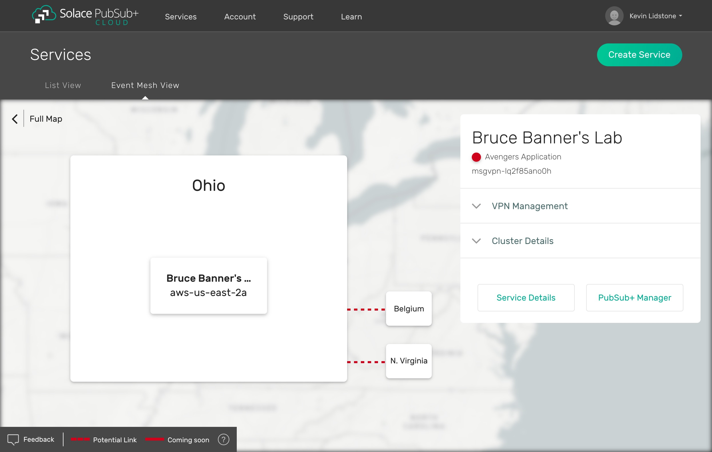

2. Launch the PubSub+ Manager for the messaging service by pressing the **PubSub+ Manager**

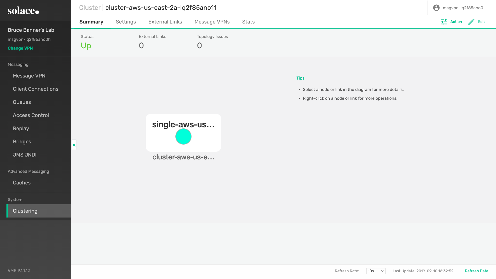

3. Navigate to the **Dynamic Message Routing** view in the main side menu, click on the **Cluster** in the list and select the **Links** tab.

4. Press the **Click to Connect** button.

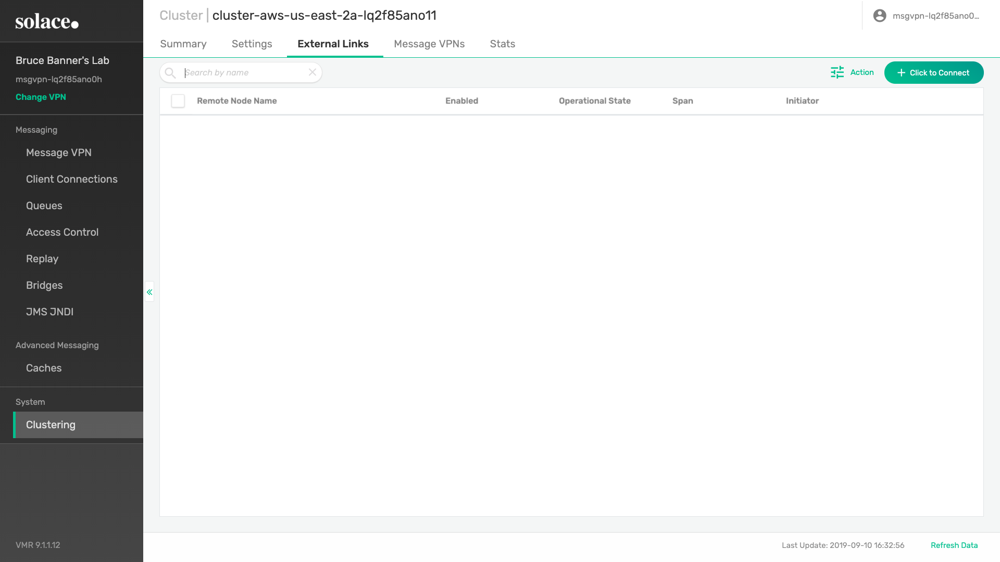

5. In the **Where to Connect To** section, choose the **Solace Cloud** button, enter your **Username** and **Password** for PubSub+ Cloud and press the **Configure Message VPN** button.

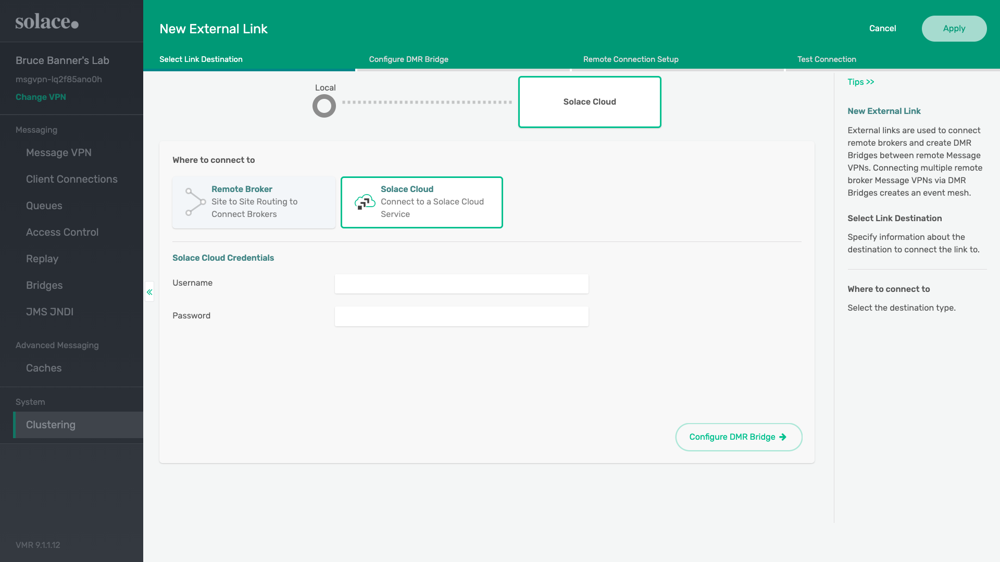

6. From the **Local Message VPN** section, choose the message VPN from your local messaging service. From the **Remote Message Service** choose the remote messaging service to connect to. Press the **Remote Connection Setup** button.

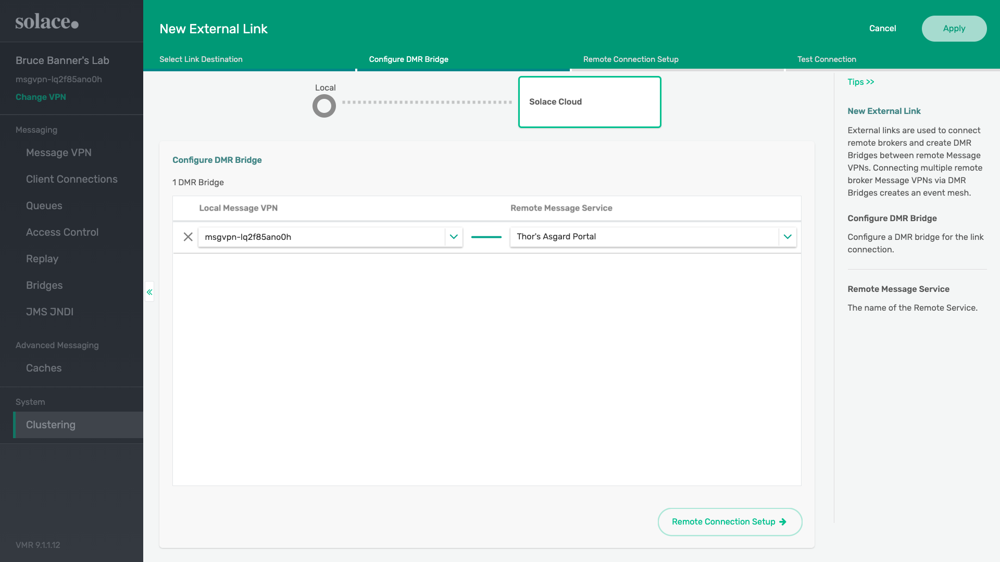

7. Now you need the required cluster passwords to continue. Return back to the PubSub+ Cloud application. Open up the remote messaging service in the **Event Mesh** view and expand the **Cluster Details**. Take note of the **Cluster Password**.

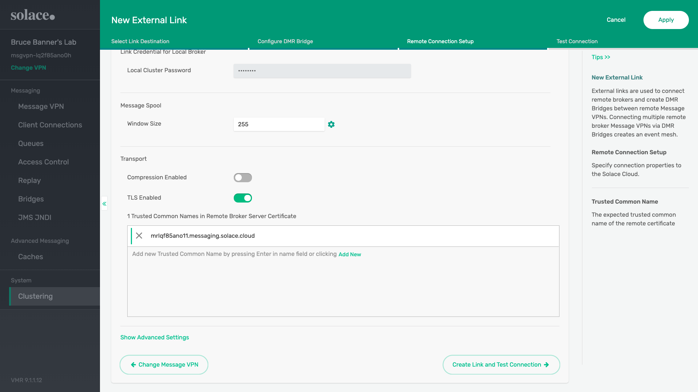

8. Open up the local messaging service in the **Event Mesh** view and expand the **Cluster Details**. Take note of the **Cluster Password**.

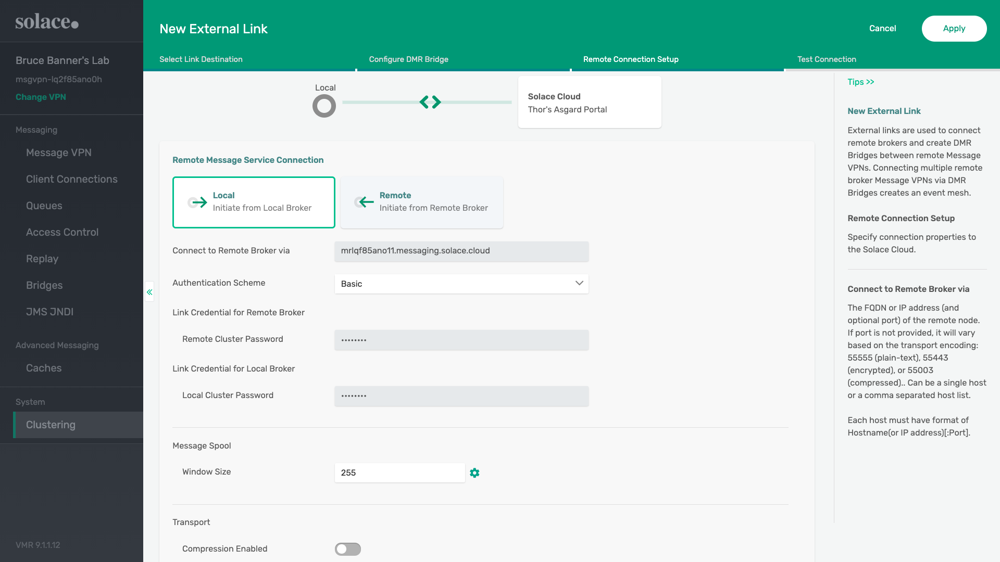

9. Enter the **Remote and Local Cluster Passwords** as noted in the previous steps. Select the switch to enable TLS. Add a common name equal to the hostname of your remote messaging service. You can find the hostname in the **Connect** tab of your service details.

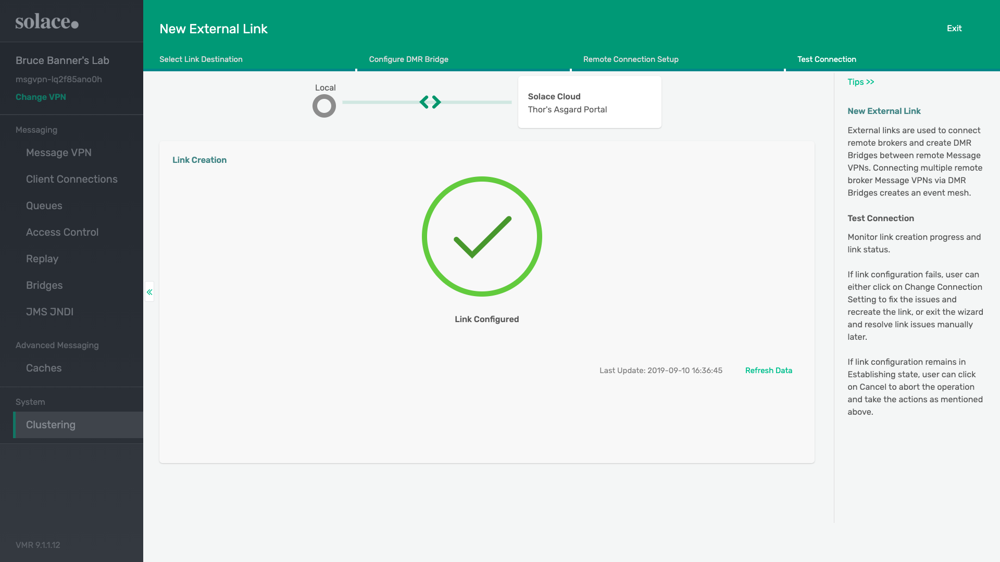

10. Finish setting up your link. This will result in a DMR bridge being created between your messaging services. Continue the steps between the other messaging services you want to partake in your Event Mesh.

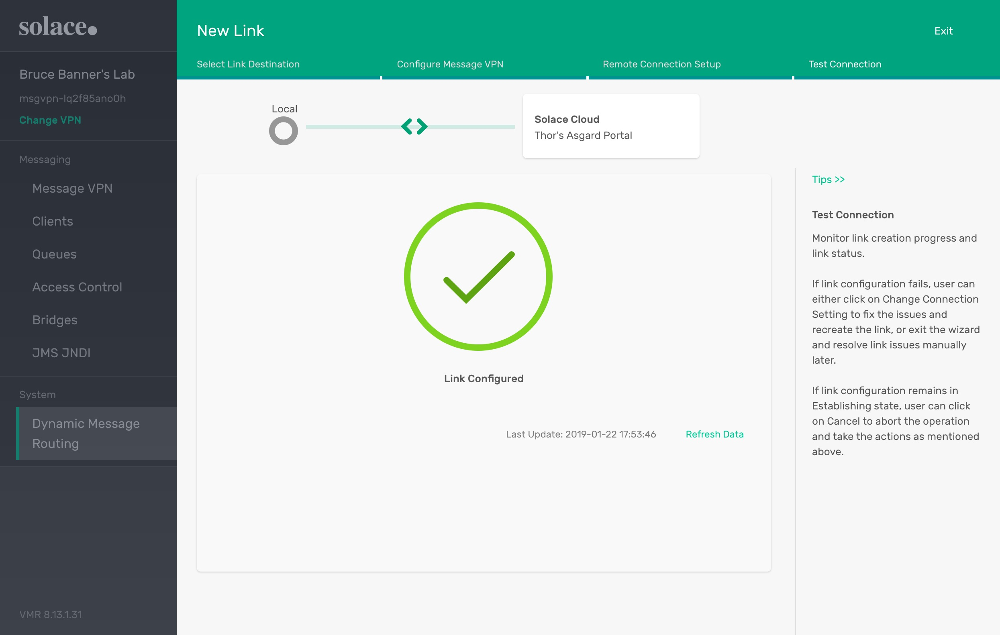

Congratulations, you have realized your Event Mesh. To see it in action, use the :doc:`Try Me tab <../group_getting_started/ggs_tryme>` in PubSub+ Cloud to create a subscription in one messaging service, publish
from another messaging service and see your message dynamically forward from one messaging service to the other.