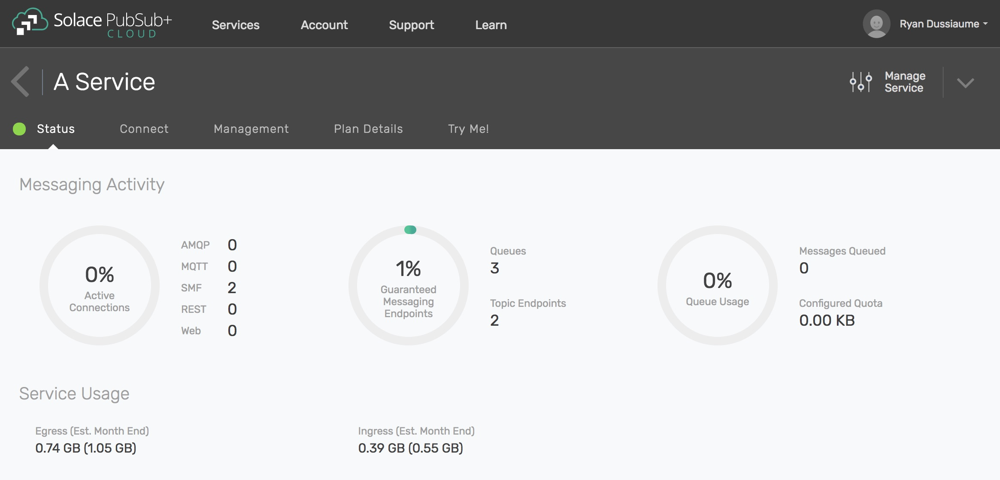

How to Manage My Data Usage
============================

When you use messaging services in PubSub+ Cloud, you are billed based on the amount of data that is used by your services. To view data usage for the current billing period for
each of your services, log into the PubSub+ Cloud Console, click on the Services tab in the header bar at the top of the page, and then select the service you want to view a
usage estimate for.

Messaging Activity
~~~~~~~~~~~~~~~~~~

The messaging activity section describes the messages sent and received on the specified PubSub+ Cloud service. Each of the dials in this section describe various aspects of data
usage, described below in order from left to right.

* The left-most dial displays the percentage of currently active connections relative to the services maximum connection capacity, in addition to the message protocol used by each of the active connections. For AWS Kilo, Mega and Tera services, additional data may be displayed in this area describing the quantity of data that has been sent and received.
* The center dial displays the percentage of queues available for connection with your service relative to the maximum queue capacity.
* The right-most dial displays the number of messages awaiting a subscriber, and the amount of space those queued messages are occupying relative to the maximum message queue capacity.

Service Status
~~~~~~~~~~~~~~

The service status section describes the current ingress and egress data usage of your messaging service, into and out of the service, respectively. Each of the quantities in this section
are calculated from the 1st day of each month to the current day in conjunction with the PubSub+ Cloud billing period.

More Details
~~~~~~~~~~~~

To get more information on your messaging service, select a service in the PubSub+ Cloud Console as described above and click on the ***Manage Service*** button in the
PubSub+ Cloud Console. This will open the PubSub+ Manager, which will provide you with real-time messaging statistics, detailed data usage metrics and service management capabilities.