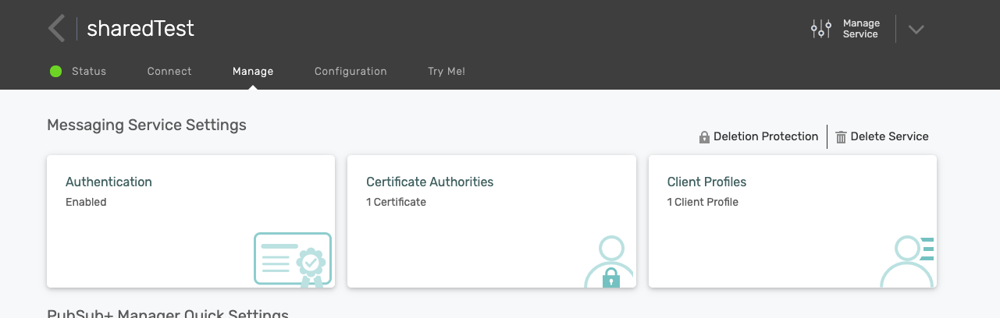
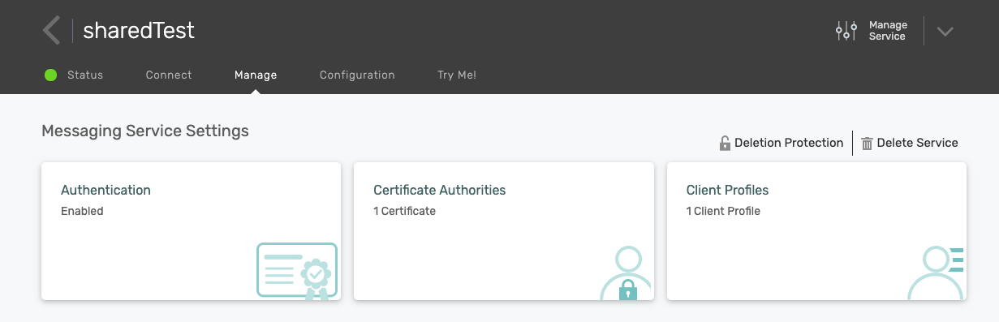

How to Use Deletion Protection
================================

You can Protect a service from getting deleted on PubSub+ Cloud. 

- Note: You must have a service created first, and by default its not protected

Enable Deletetion Protection:
~~~~~~~~~~~~~~~~~~~~~~~~~~~~~~~~

1. Go to your service details page by clicking on your service.
2. On the service details page, navigate to the Manage tab.
3. Click on Deletion protection button to enable protection.

Disable Deletetion Protection:
~~~~~~~~~~~~~~~~~~~~~~~~~~~~~~~~

1. Go to your service details page by clicking on your service.
2. On the service details page, navigate to the Manage tab.
3. Click on Deletion protection button to disable protection.

