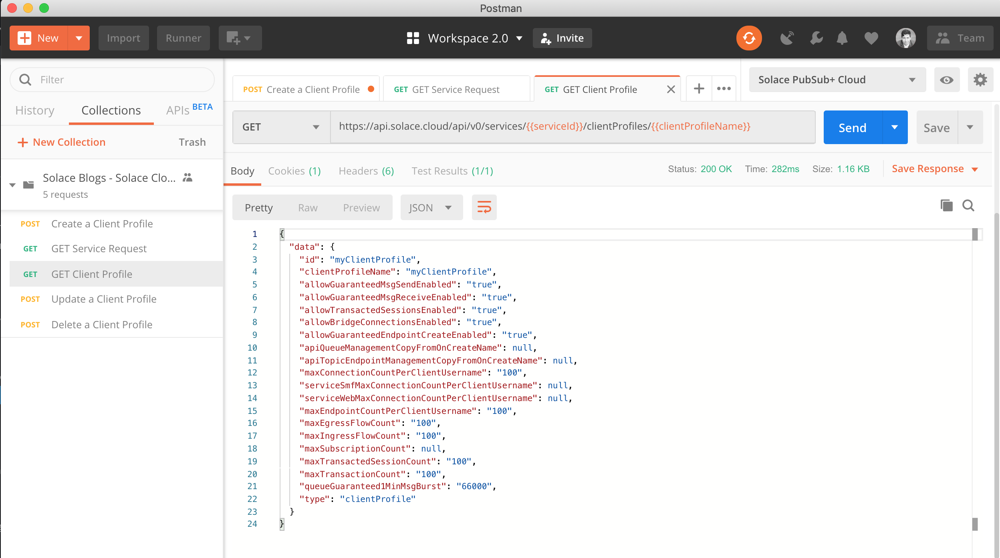

How to Use the Solace Cloud REST API to Manage Client Profiles
==============================================================

The Solace PubSub+ Cloud REST APIs and API tokens now support service client profile management. This allows administrators to create, update, and delete client profiles on their services programmatically.

In this blog post, I’ll show you how you can:

1. Grab an API token from Solace Cloud using your account
2. Use that API token to create a new client profile on your service
3. Retrieve the client profile info
4. Update and delete the client profile

The tutorial assumes you know what REST is and kind of know how to send REST requests using your favorite tool. But it's okay if you don’t. `Check out this REST intro <https://www.restapitutorial.com/lessons/whatisrest.html>`_ and then come back.

Setup
~~~~~

What you'll need:

* A Solace PubSub+ Cloud Account.
* Administrator or Messaging Service Editor permissions for your account.
* A Solace PubSub+ Cloud service.
* A way to send REST messages from your dev environment. Postman (6.1.3 or greater) is a good choice if you want a visual REST API Dev Tool.
* Click this `link to import the Postman collection <https://documenter.getpostman.com/view/3081638/RWM8SWza>`_ then hit the “Run in Postman” button.

Installing Postman
------------------

If you don’t have Postman installed when you hit “Run in Postman”, it will prompt you to install it (which doesn’t take long). Once Postman is installed, you will need to shut it down and click on the “Run in Postman” link again to import the Postman collection.
If you prefer using CURL, the Postman link above provides the sample CURL commands.

Create an API Token
~~~~~~~~~~~~~~~~~~~

You need an API token to authenticate and authorize REST requests. When creating an API token, you will configure what permissions it has (i.e., a subset of the permissions you have when you log in to Solace Cloud)

1. Log in to Solace Cloud
2. Click on your name in the right side of the menu bar to navigate to Token Management.

.. image:: ../img/userApi_1.png
   :target: https://console.solace.cloud/api-tokens

3. Click the “Create Token” button

.. image:: ../img/userApi_2.png
   :target: https://console.solace.cloud/api-tokens

4. Give the Token a name and enable these permissions:

  * Get Services (To retrieve the service's client profile details)
  * Get Service Requests
  * Create/Update/Delete Client Profiles

  Note: If you don't see these permissions listed in the Create Token menu, you may not have adequate permissions for your account. Touch base with your account administrator to request access, or contact PubSub+ Cloud support if there is a problem with your permissions.

5. Click the “Generate Token” button
6. Copy the token to your clipboard by clicking the “Copy” button. **Note:** You will not see this again for security reasons. If you lose the token, you can always regenerate the token or create a new one.
7. Set up Postman Collection Authorization – In order for Postman to send REST to Solace Cloud, you need to set the token you just created

  a. Set the Postman Environment `here <https://documenter.getpostman.com/view/3081638/RWM8SWza>`_ to **Solace PubSub+ Cloud** -- look in the drop down in the upper left part of the Postman window.

  .. image:: ../img/clientProfileApi_2.png

  b. Edit the Solace PubSub+ Cloud environment and set the token by clicking on eye icon next to the environment drop down. Then click Edit next to **Solace PubSub+ Environment**.

  c. Paste the token in the value field of the **apiToken** key and then click Update.

  .. image:: ../img/clientProfileApi_3.png

While you're at it, you can go ahead and fill in your serviceId as well. An easy way to find your serviceId is to open the service details on the Solace PubSub+ Cloud console and look at the end of the URL.

**Great!** Now we have a token, and Postman is set up to use it!

Let’s use it to do some stuff.

Create a Client Profile using the REST API
~~~~~~~~~~~~~~~~~~~~~~~~~~~~~~~~~~~~~~~~~~~~~~~~~~~~

Now that we have a token, we can use it call the REST endpoint to create a client profile.

1. In the Postman Collection `here <https://documenter.getpostman.com/view/3081638/RWM8SWza>`_ “*Solace Blogs – Solace Cloud Client Profile Management*”, select the request “**Create a Client Profile**”

2. Change the 'clientProfileName' field to the name you wish to give your client profile. The other properties can be changed to fit your needs. For more information on each setting, `see the Client Profile Configuration documentation <https://docs.solace.com/Configuring-and-Managing/Configuring-Client-Profiles.htm>`_

You should see a JSON response confirming that the request was accepted.

The request shouldn't take more than a second or two. You can check the status of the request using the "**GET Service Request**" method in the postman collection. The requestId should be added to your environment for you already, so just press send!

Now that we see that our request is marked as 'completed', we can retrieve the created client profile from the API.

Get Client Profile Details
~~~~~~~~~~~~~~~~~~~~~~~~~~~~~~~~~~~~~~~~~~~~~~~~~~~~

Now let’s retrieve the Client Profile.

1. In the Postman Collection `here <https://documenter.getpostman.com/view/3081638/RWM8SWza>`_ “*Solace Blogs – Solace Cloud Client Profile Management*”, select the request “**Get Client Profile**”

2. The previous 'Create Client Profile' step should have already populated the required 'clientProfileName' variable in the path. Click on the Send button

You should be able to see the details of the client profile in the bottom panel.

Update a Client Profile
~~~~~~~~~~~~~~~~~~~~~~~~~~~~~~~~~~~~~~~~~~~~~~~~~~~~

Now that we've created and retrieved our client profile, we'll try changing some of its properties.

1. In the Postman Collection `here <https://documenter.getpostman.com/view/3081638/RWM8SWza>`_ “*Solace Blogs – Solace Cloud Client Profile Management*”, select the request “**Update a Client Profile**”

2. In the body of the request, we can change 'allowGuaranteedMsgSendEnabled' and 'allowGuaranteedMsgReceiveEnabled' to false. the 'clientProfileName' property should line up with the name of the client profile you created earlier. This will update the client profile's existing properties when we send the request. Click on the Send button

In the JSON response, we can see that the request has been accepted, and we can see the new value for the properties we updated. Once the request is finished, we can see the new values in the client profile with the '**GET Client Profile**'.

Delete a Client Profile
~~~~~~~~~~~~~~~~~~~~~~~~~~~~~~~~~~~~~~~~~~~~~~~~~~~~

Now that we've used our client profile to test out the APIs, we may want to clean up.

1. In the Postman Collection `here <https://documenter.getpostman.com/view/3081638/RWM8SWza>`_ “*Solace Blogs – Solace Cloud Client Profile Management*”, select the request “**Delete a Client Profile**”

2. Click on the Send button

You should receive a 202 Accepted response confirming that the delete request was received.

After confirming that the request has completed, you should be able to call the **GET Client Profile** request once more. The response should indicate that the client profile is not found.

