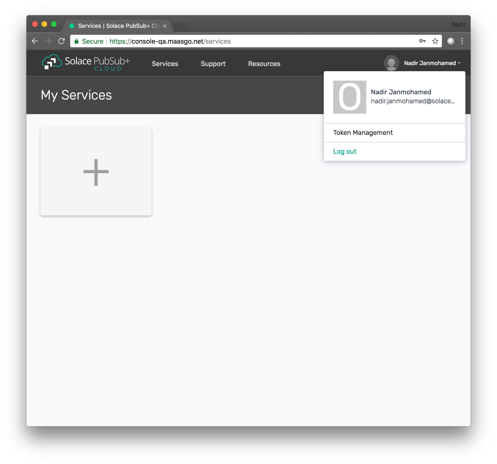
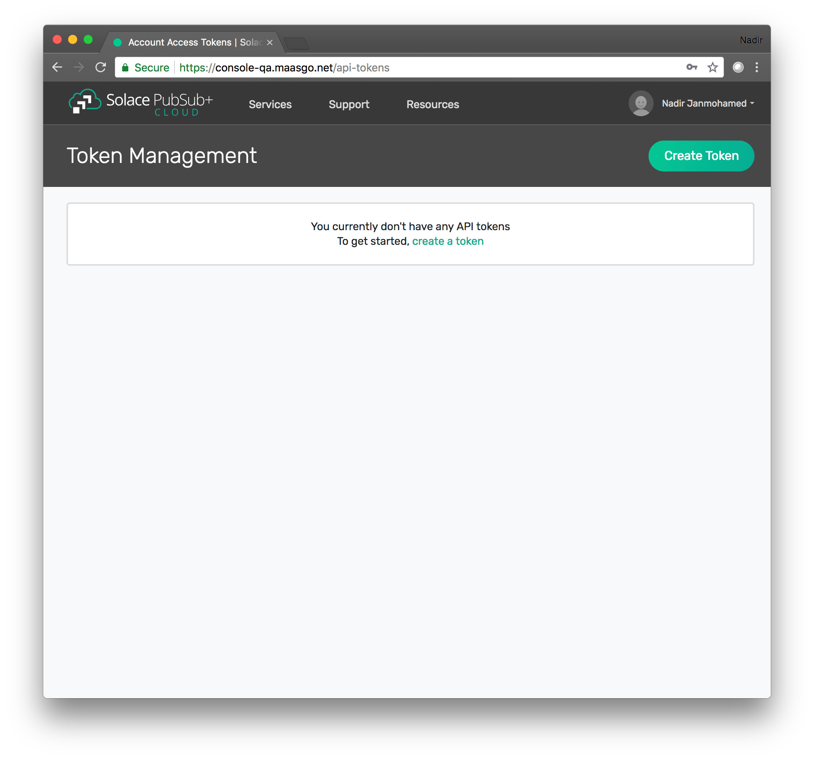
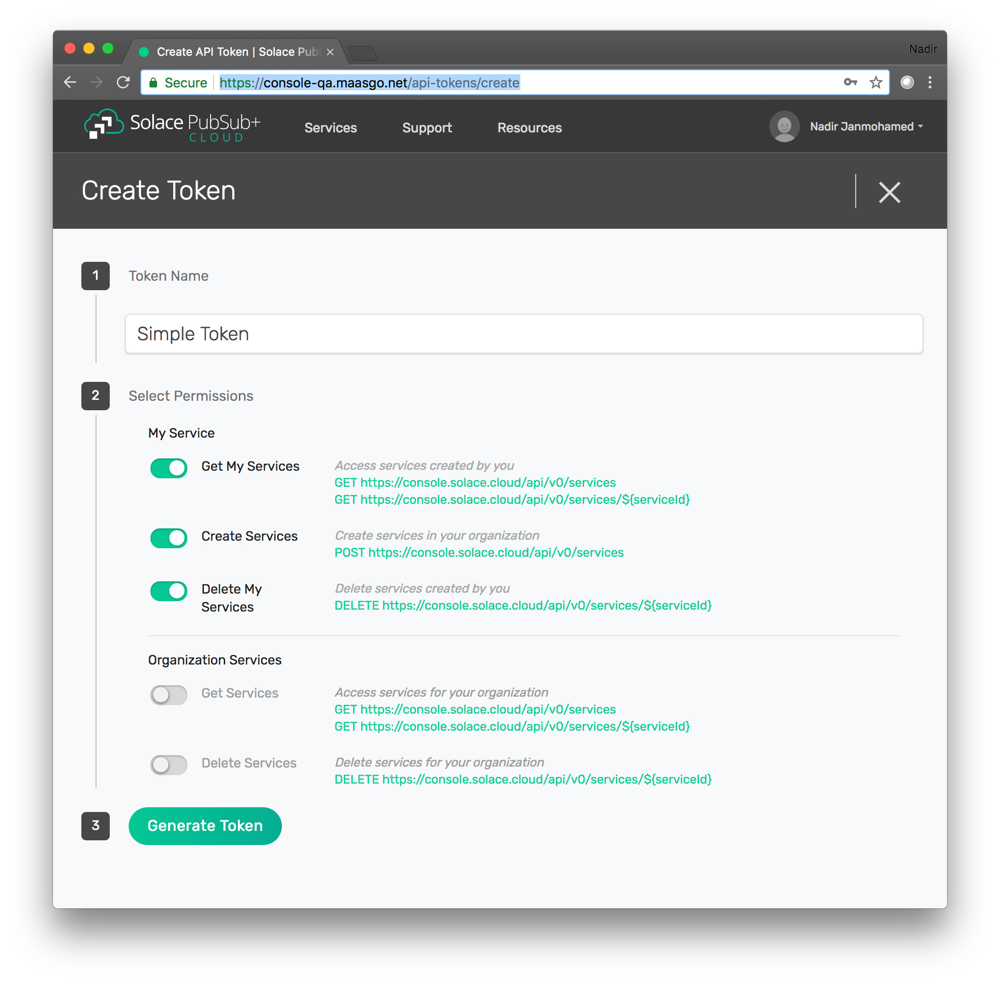
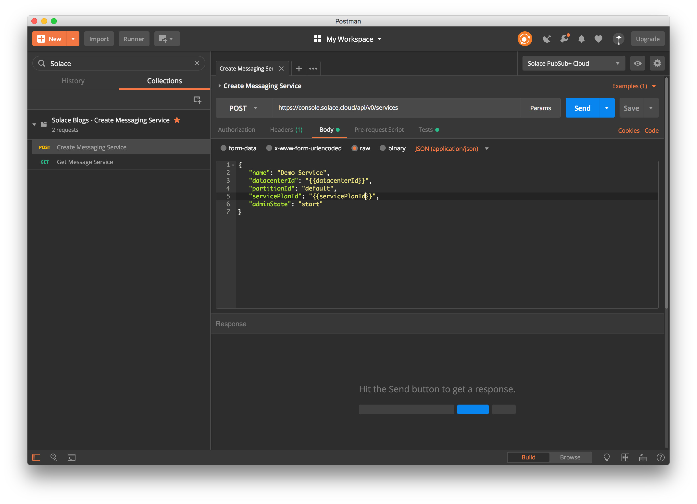
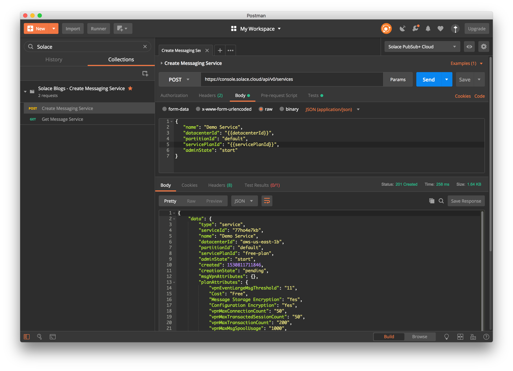
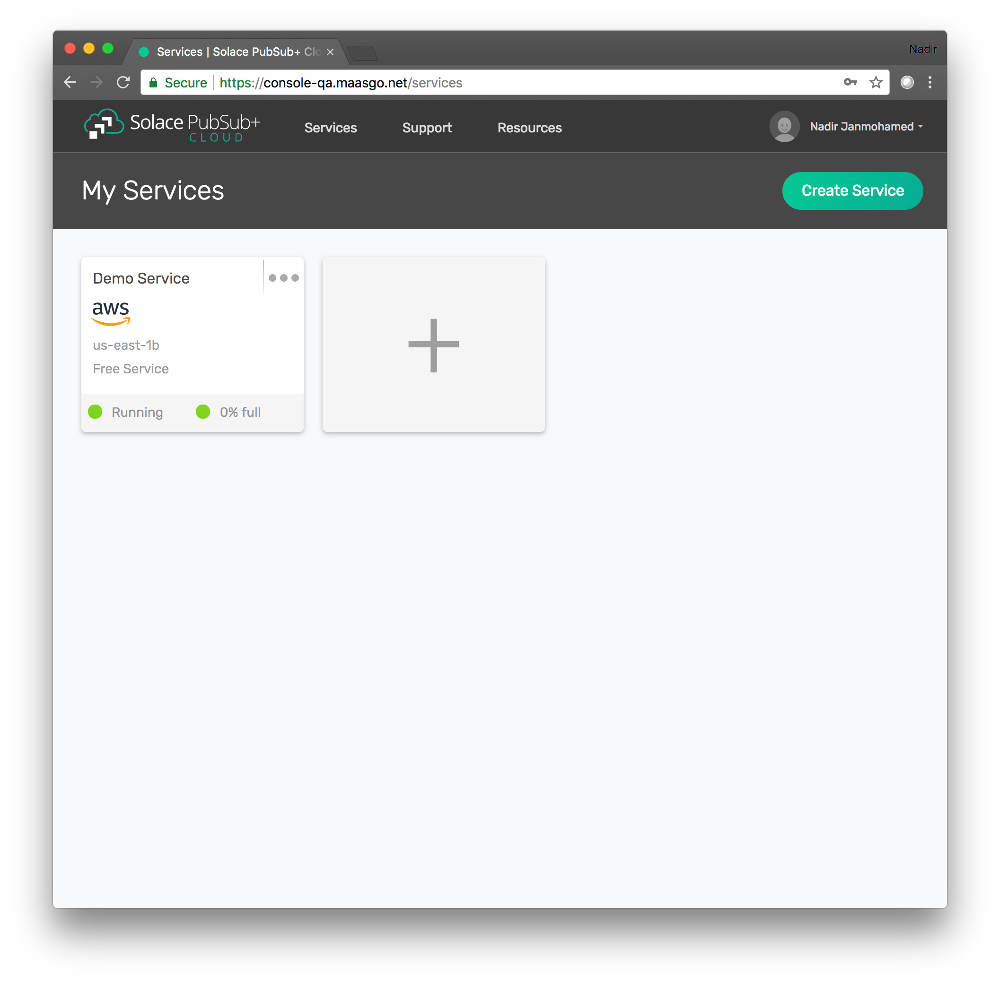
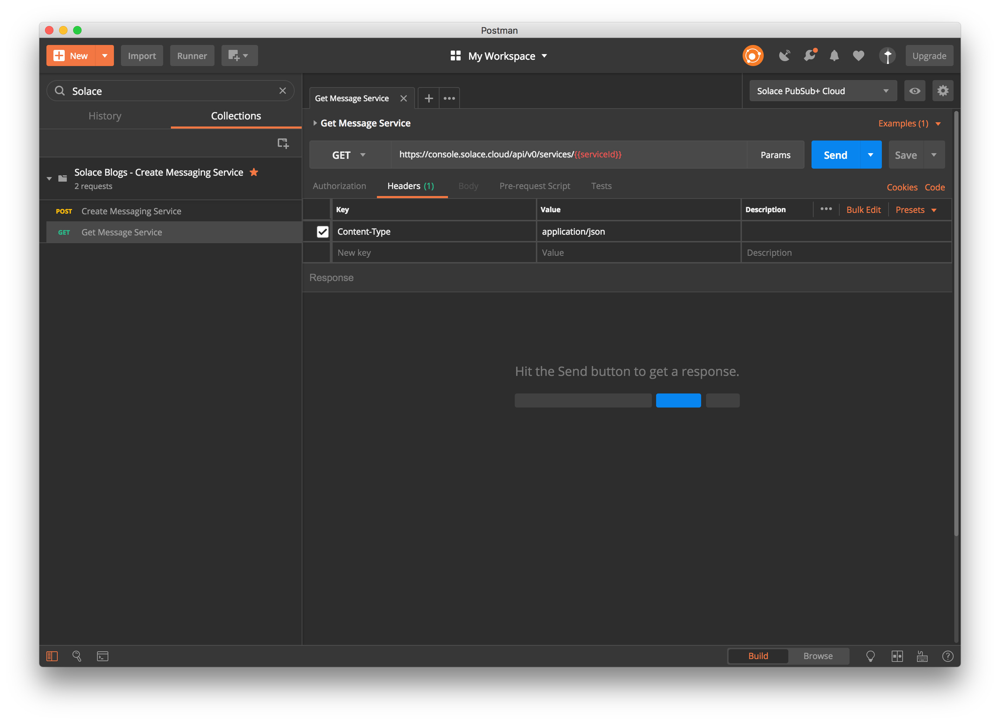
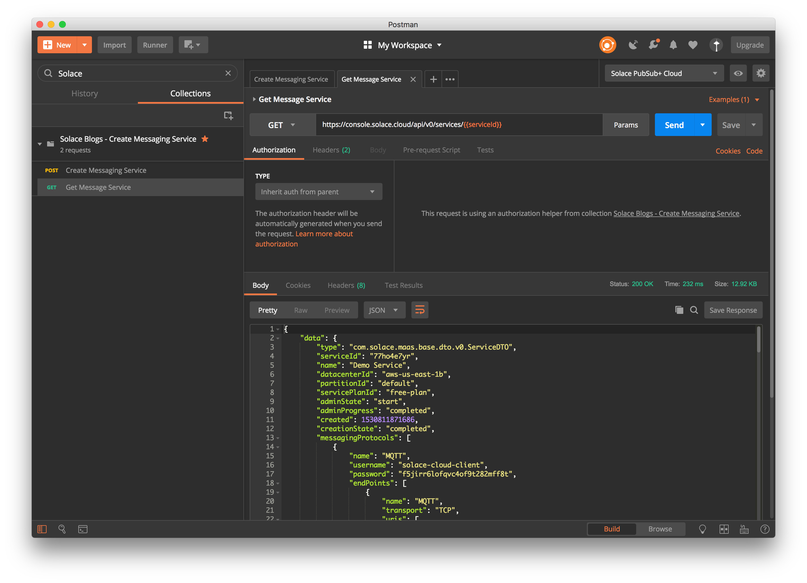

How to Use the Solace Cloud REST API to Manage Services
=======================================================

If you’re familiar with developing and deploying in a cloud environment, a common practice is to bring up a cloud resource using a cloud provider’s APIs, use that resource, then remove it when you are done. This is all accomplished programmatically, avoiding the need to start or stop the resources manually using the cloud provider’s user interface.

For example, a common flow for testing an app would be to:

1. Bring up a cloud server (e.g., an AWS EC2) programmatically
2. Install and test your app on that cloud server
3. Tear down the cloud server when your testing is complete

Solace PubSub+ Cloud has introduced REST APIs and REST API token support (in beta). This means developers can use Solace Cloud’s REST APIs to create PubSub+ Cloud messaging services and extract information about them programmatically.

In this blog post, I’ll show you how you can:

1. Grab an API token from Solace Cloud using your account
2. Use that API token to create a messaging service via Solace Cloud’s REST APIs
3. Use the REST APIs to pull out the MQTT connection details for the new messaging service (which could be used in your apps to send/receive MQTT messages)

Assumptions:

* You know what REST is and kind of know how to send REST requests using your favorite tool.

But if you don’t, `check out this REST intro <https://www.restapitutorial.com/lessons/whatisrest.html>`_ and then come back.

Setup
~~~~~

* `Sign up for Solace Cloud <https://cloud.solace.com/signup/>`_ if you haven’t already -- don’t worry, it’s free.
* You need a way to send REST messages from your dev environment. Postman (6.1.3 or greater) is a good choice if you want a visual REST API Dev Tool
* Click this `link to import the Postman collection <https://documenter.getpostman.com/view/3081638/RWM8SWza>`_ then hit the “Run in Postman” button.

Installing Postman
------------------

If you don’t have Postman installed when you hit “Run in Postman”, it will prompt you to install it (which doesn’t take long). Once Postman is installed, you will need to shut it down and click on the “Run in Postman” link again to import the Postman collection.
If you prefer using CURL, the Postman link above provides the sample CURL commands.

Create an API Token
~~~~~~~~~~~~~~~~~~~

You need an API token to authenticate and authorize REST requests. When creating an API token, you will configure what permissions it has (i.e., a subset of the permissions you have when you log in to Solace Cloud)

1. Log in to Solace Cloud
2. Click on your name in the right side of the menu bar to navigate to Token Management.

3. Click the “Create Token” button

4. Give the Token a name and enable these permissions:

  * Get My Services
  * Create Services
  * Delete My Services

5. Click the “Generate Token” button
6. Copy the token to your clipboard by clicking the “Copy” button. **Note:** You will not see this again for security reasons. If you lose the token, you can always regenerate the token or create a new one.
7. Set up Postman Collection Authorization – In order for Postman to send REST to Solace Cloud, you need to set the token you just created

  a. Set the Postman Environment to **Solace PubSub+ Cloud** -- look in the drop down in the upper left part of the Postman window.

  .. image:: ../img/use_api_tokens_4.jpg

  b. Edit the Solace PubSub+ Cloud environment and set the token by clicking on eye icon next to the environment drop down. Then click Edit next to **Solace PubSub+ Environment**.

  .. image:: ../img/use_api_tokens_5.jpg

  c. Paste the token in the value field of the **apiToken** key and then click Update.

  .. image:: ../img/use_api_tokens_6.jpg

**Great!** Now we have a token, and Postman is set up to use it!

Let’s use it to do some stuff.

Create a Messaging Service using the REST API
~~~~~~~~~~~~~~~~~~~~~~~~~~~~~~~~~~~~~~~~~~~~~~~~~~~~

Now that we have a token, we can use it call the service REST endpoint to create a messaging service.

1. In the Postman Collection “*Solace Blogs – Create Messaging Service*”, select the request “**POST Create Messaging Service**”

2. Click on the Send button,

You should see a JSON response confirming that a messaging service was created.

Now go back to Solace Cloud and you should see your service.

Awesome! You have just created a messaging service.

Get the Connection Details for the Messaging Service
~~~~~~~~~~~~~~~~~~~~~~~~~~~~~~~~~~~~~~~~~~~~~~~~~~~~

Now let’s retrieve the messaging service connection details. The Solace PubSub+ Cloud Messaging Service supports almost all of the messaging protocols under the sun! Let’s pick MQTT for the sake of this exercise, but this API provides you with all supported protocols.

1. In the Postman Collection “*Solace PubSub+ Cloud – Create Messaging Services*”, select the request **Get Messaging Service**.

2. Click on the Send button

You should be able to see the MQTT connection details in the JSON response.

Now you can use the connection details to start sending MQTT messages to your new messaging service from your app.

Cool.

You now have everything you need to create Solace PubSub+ Cloud messaging services in a cloud stylie way.

These REST APIs are still BETA, so any feedback is welcome. Please use the feedback section of the Support tab in the Solace Cloud console to let us know what you think.

Have fun!