How to Use the Solace Cloud REST API to Manage Users
====================================================

In addition our messaging service APIs, Solace PubSub+ Cloud has introduced REST APIs and token support for account user management. This allows administrators to create, update, and delete users from their account programmatically.

In this blog post, I’ll show you how you can:

1. Grab an API token from Solace Cloud using your account
2. Use that API token to invite a new user to your account
3. Retrieve user info
4. Update user permissions
5. Delete a user from your account

The tutorial assumes you know what REST is and kind of know how to send REST requests using your favorite tool. But it's okay if you don’t. `Check out this REST intro <https://www.restapitutorial.com/lessons/whatisrest.html>`_ and then come back.

Setup
~~~~~

What you'll need:

* A Solace PubSub+ Cloud Enterprise Account. As only Enterprise Accounts support multiple users, these REST endpoints cannot be used otherwise. 
* Administrator permissions for your account. 
* You need a way to send REST messages from your dev environment. Postman (6.1.3 or greater) is a good choice if you want a visual REST API Dev Tool
* Click this `link to import the Postman collection <https://documenter.getpostman.com/view/4953125/RztsomaP>`_ then hit the “Run in Postman” button.

Installing Postman
------------------

If you don’t have Postman installed when you hit “Run in Postman”, it will prompt you to install it (which doesn’t take long). Once Postman is installed, you will need to shut it down and click on the “Run in Postman” link again to import the Postman collection.
If you prefer using CURL, the Postman link above provides the sample CURL commands.

Create an API Token
~~~~~~~~~~~~~~~~~~~

You need an API token to authenticate and authorize REST requests. When creating an API token, you will configure what permissions it has (i.e., a subset of the permissions you have when you log in to Solace Cloud)

1. Log in to Solace Cloud
2. Click on your name in the right side of the menu bar to navigate to Token Management.

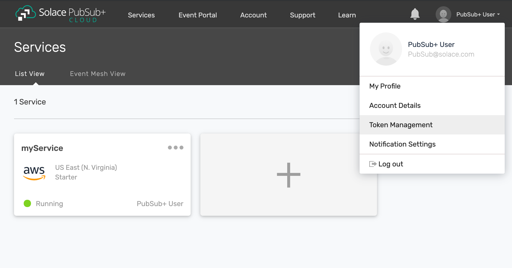

3. Click the “Create Token” button

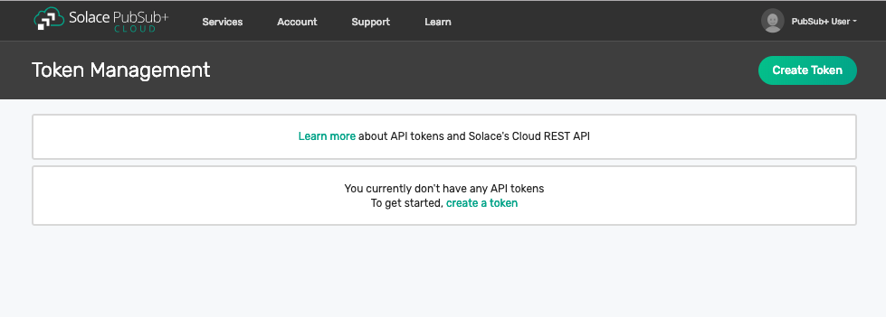

4. Give the Token a name and enable these permissions:

  * Get Users
  * Get Roles
  * Create User
  * Delete Users
  * Put Roles

  Note: If you don't see these permissions listed in the Create Token menu, you may not have adequate (administrator) permissions for your account. Touch base with your account administrator to request access, or contact PubSub+ Cloud support if there is a problem with your permissions.

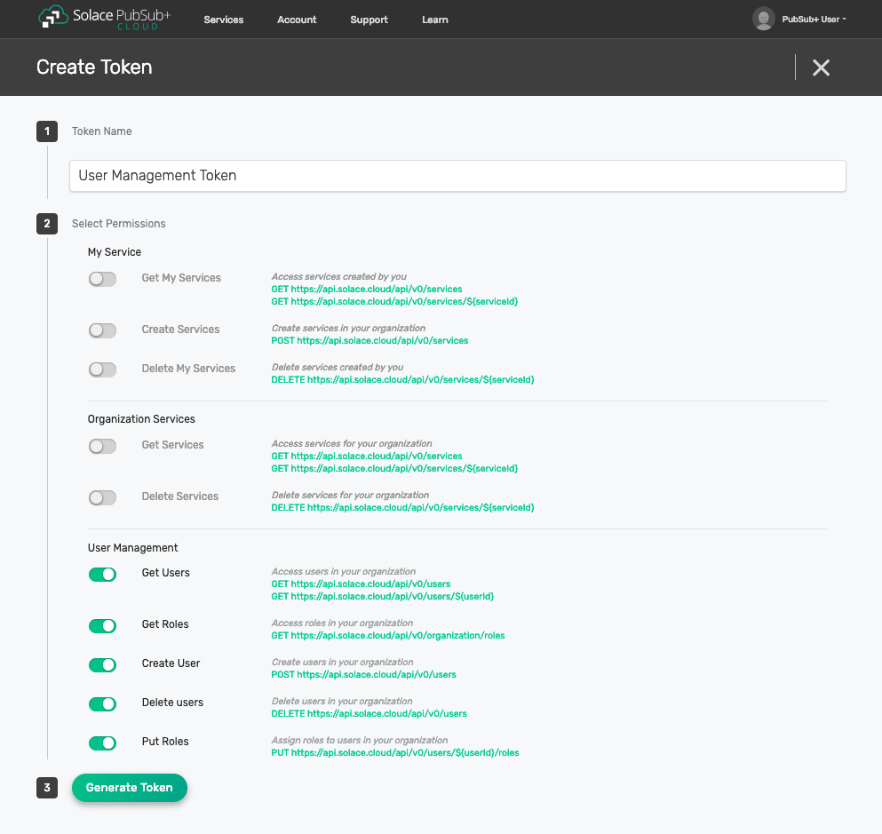

5. Click the “Generate Token” button
6. Copy the token to your clipboard by clicking the “Copy” button. **Note:** You will not see this again for security reasons. If you lose the token, you can always regenerate the token or create a new one.
7. Set up Postman Collection Authorization – In order for Postman to send REST to Solace Cloud, you need to set the token you just created

  a. Set the Postman Environment to **Solace PubSub+ Cloud** -- look in the drop down in the upper left part of the Postman window.

  .. image:: ../img/userApi_4.png

  b. Edit the Solace PubSub+ Cloud environment and set the token by clicking on eye icon next to the environment drop down. Then click Edit next to **Solace PubSub+ Environment**.

  c. Paste the token in the value field of the **apiToken** key and then click Update.

  .. image:: ../img/userApi_5.png

**Great!** Now we have a token, and Postman is set up to use it!

Let’s use it to do some stuff.

Create a User using the REST API
~~~~~~~~~~~~~~~~~~~~~~~~~~~~~~~~~~~~~~~~~~~~~~~~~~~~

Now that we have a token, we can use it call the user REST endpoint to create a user.

1. In the Postman Collection “*Solace Blogs – Solace Cloud User Management*”, select the request “**POST Invite User**”

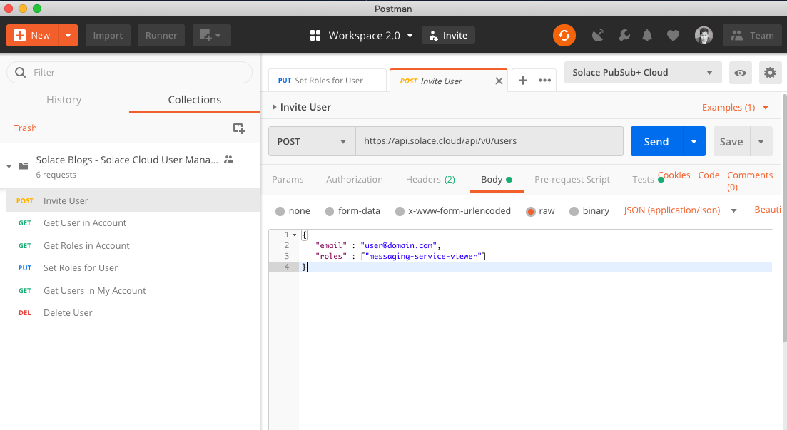

2. Change the 'email' field to the email address of the user you wish to invite, then click on the Send button

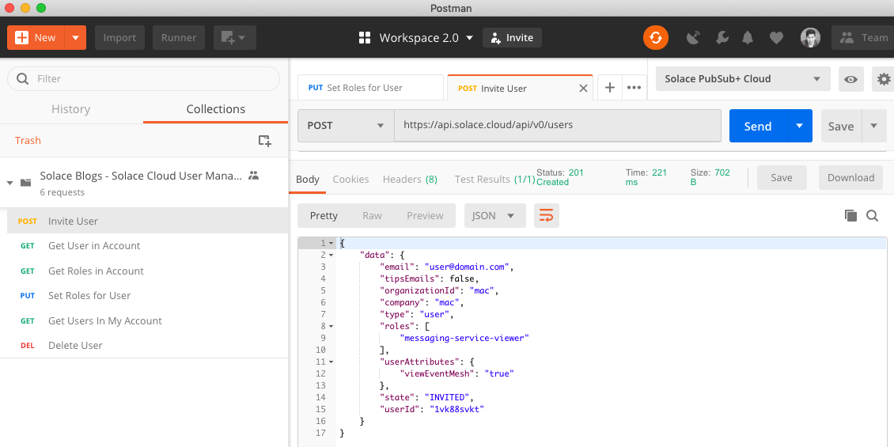

You should see a JSON response confirming that a user was invited.

Now go back to the Solace Cloud Account Management page and you should the invited user.

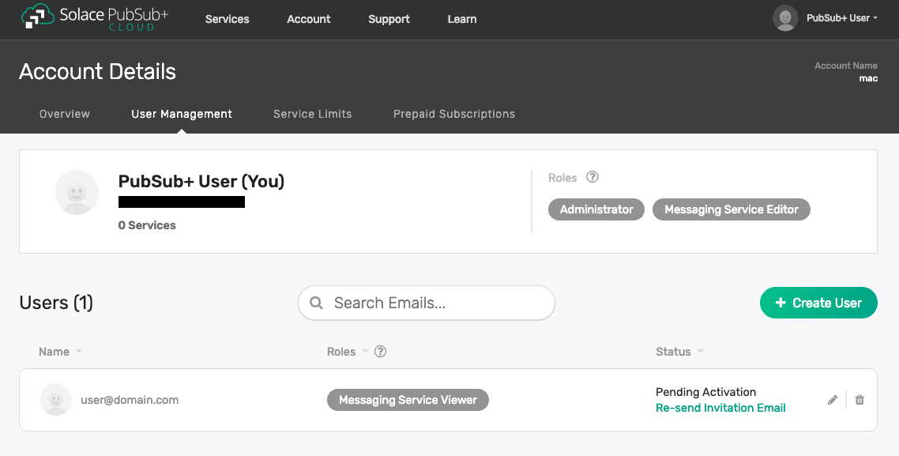

Awesome! You have just invited a user. The email address provided should recieve an invitation email which will guide the user through the rest of the activation process. 

Get User Details
~~~~~~~~~~~~~~~~~~~~~~~~~~~~~~~~~~~~~~~~~~~~~~~~~~~~

Now let’s retrieve user details. 

1. In the Postman Collection “*Solace Blogs – Solace Cloud User Management*”, select the request “**Get User in Account**”

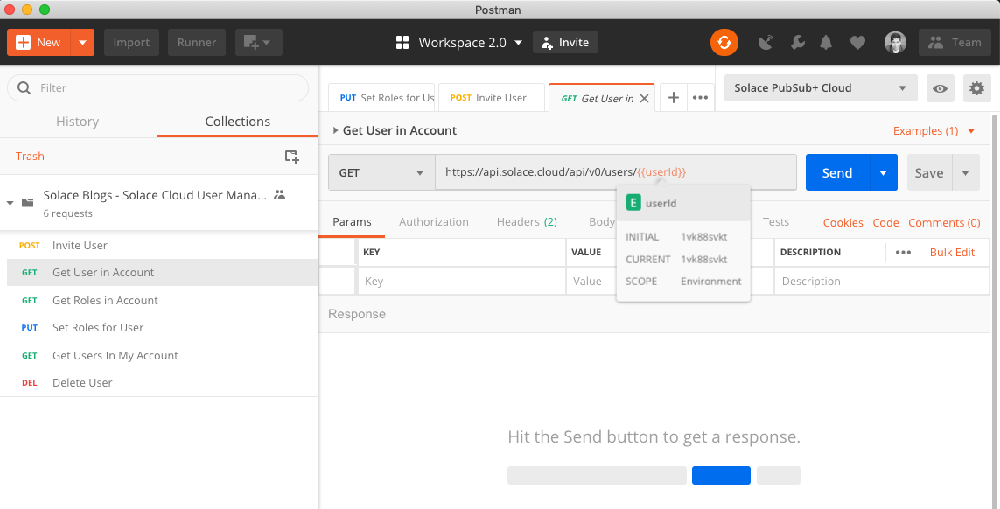

2. The previous 'Invite User' step should have already populated the required 'userId' variable in the path. Click on the Send button

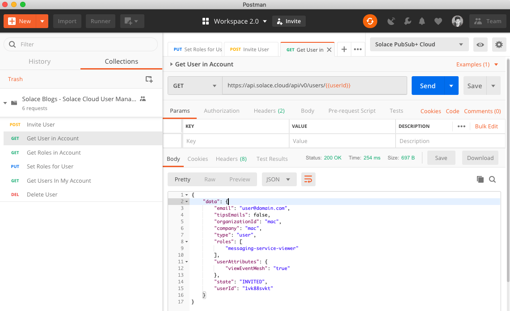

You should be able to see the details of the user. 

Assign Roles to a User
~~~~~~~~~~~~~~~~~~~~~~~~~~~~~~~~~~~~~~~~~~~~~~~~~~~~

Now that we've created and retrieved our new user, we'll try changing the roles assigned to them.

First, we'll want to look at a list of roles we can assign. 

1. In the Postman Collection “*Solace Blogs – Solace Cloud User Management*”, select the request “**Get Roles in Account**”

.. image:: ../img/userApi_11.png

2. Click on the Send button

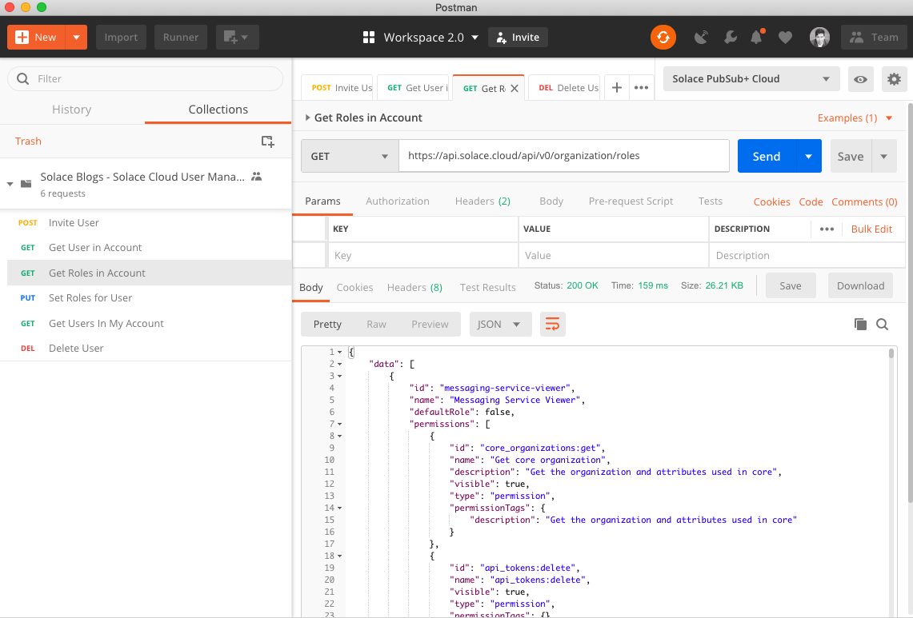

You should be able to see a list of available roles, each with a list of permissions they contain.  

Now, to change the role of our user.

1. In the Postman Collection “*Solace Blogs – Solace Cloud User Management*”, select the request “**PUT Set Roles for User**”

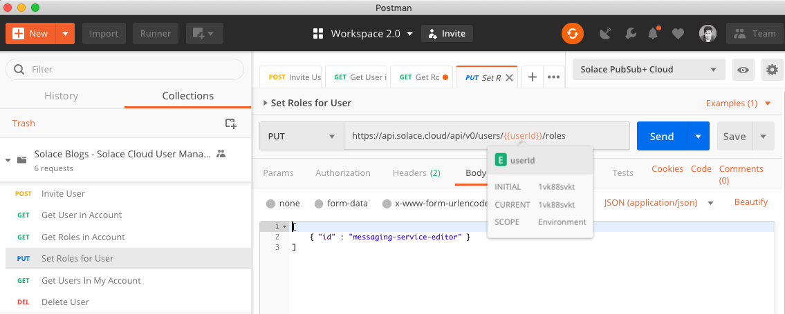

2. In the body of the request, we see 'messaging-service-editor'. the 'id' will line up with the 'id' field of one of the roles returned in the previous step. This will replace the user's existing roles when we send the request. Click on the Send button

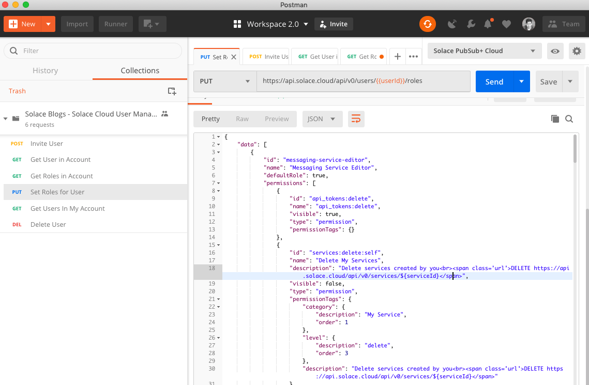

In the JSON response, there is a list of roles which are now assigned to the user. The user can now create and delete services, rather than just viewing them. 

Delete a User
~~~~~~~~~~~~~~~~~~~~~~~~~~~~~~~~~~~~~~~~~~~~~~~~~~~~

Now that we've used our user to test out the management APIs, we may want to clean up. 

1. In the Postman Collection “*Solace Blogs – Solace Cloud User Management*”, select the request “**Delete User**”

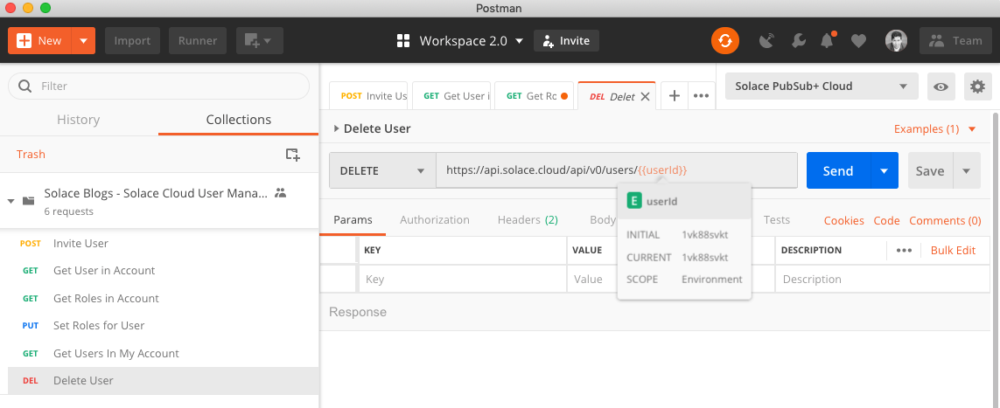

2. Click on the Send button

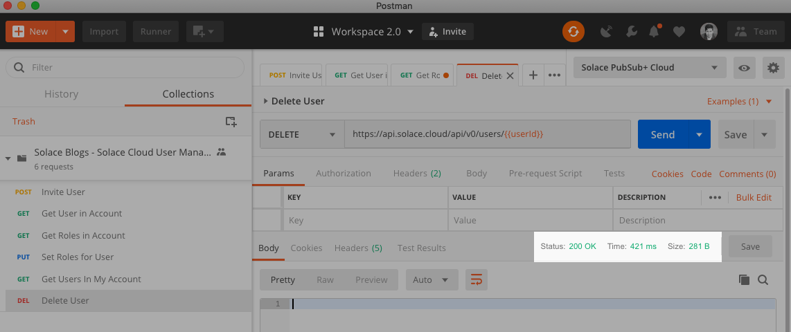

You should receive a 200 OK response confirming that the delete request was accepted.

