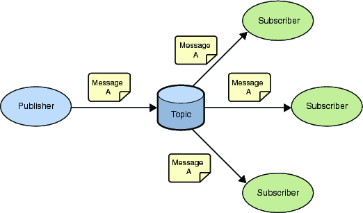

Chat Demo Sample
================

In development terms, **Messaging** refers to the set of concepts that lets computer systems, applications or services share
information without requiring coupling [1]_ or awareness of one another's location. When developing applications or services,
decoupling

So what are the core concepts that you need to know:

- **Publisher**: the entity that sends or publishes the **Message** - Also called **Producer**
- **Message** or **Event**: what the **Publisher** wants to say to the **Subscriber**
- **Subscriber**: the ultimate receiver of the **Message** or **Event** - Also called **Consumer**

In addition:

- A **Message** typically has a destination that decouples the **Publisher** from the **Subscriber**
- A destination can be a **Topic** or a **Queue**:
    - **Topic** when the **Message** is intended to be consumed by more than one **Subscribers**
    - **Queue** when the **Message** is intended to be consumed by at most one **Subscriber**

.. [1] We should try to keep the coupling between components in our systems as 'loose' as possible to allow
    the implementation of each component to change without unduly affecting the others.