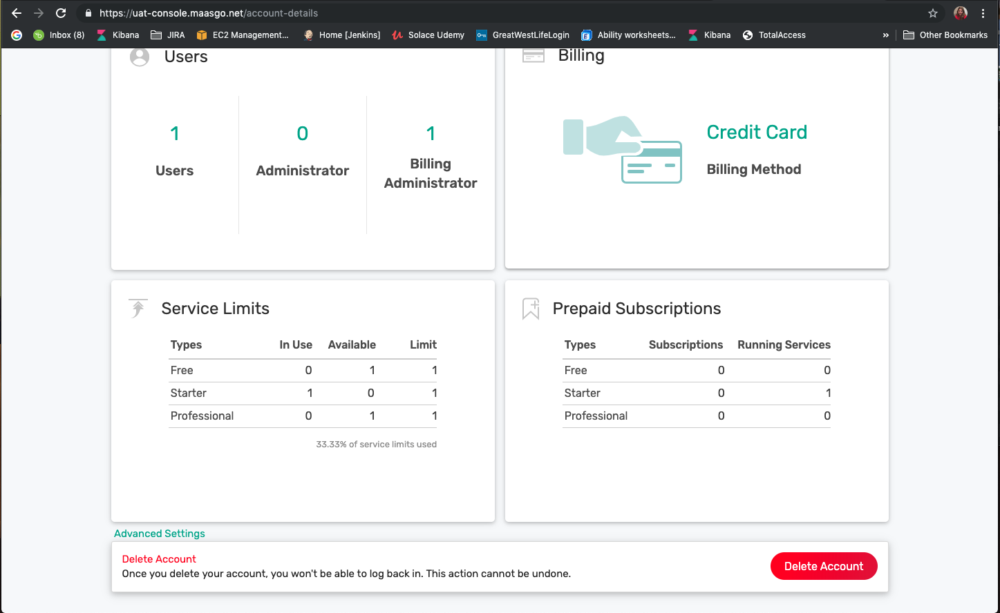
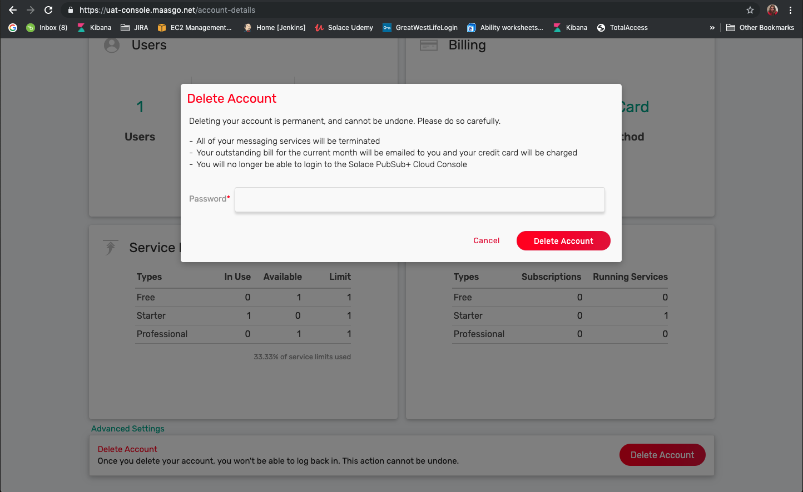
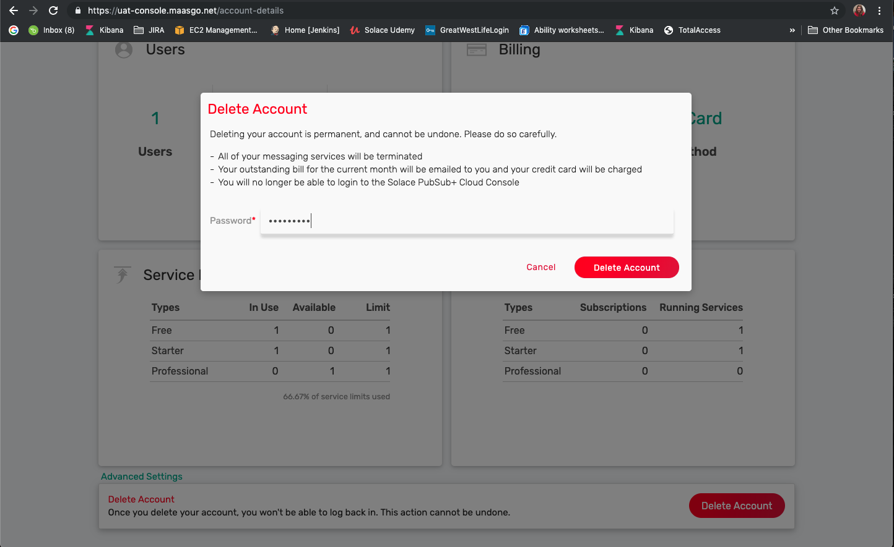
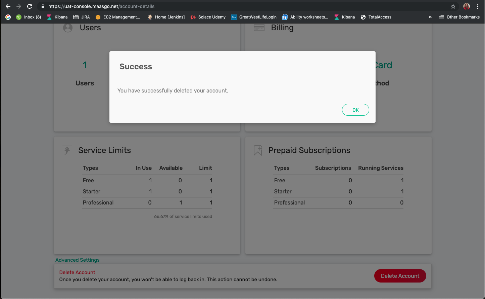

Account Deletion
================================

You can now delete your account without asking help from Solace Cloud support. However, this feature is limited to standard accounts only.

In the below image, under Account tab, the Advance Setting link is been added to provide option for deleting account.

After clicking the Delete Account button you would get a confirmation pop up which will inform you about all the impacts post deletion of your account.

You would require to enter your password to ensure that it is an intentional deletion and voila, the account is deleted.

Once the account is deleted, all of your messaging services will be terminated, your outstanding bill will be emailed to you and your credit card would be charged as per the usage.
