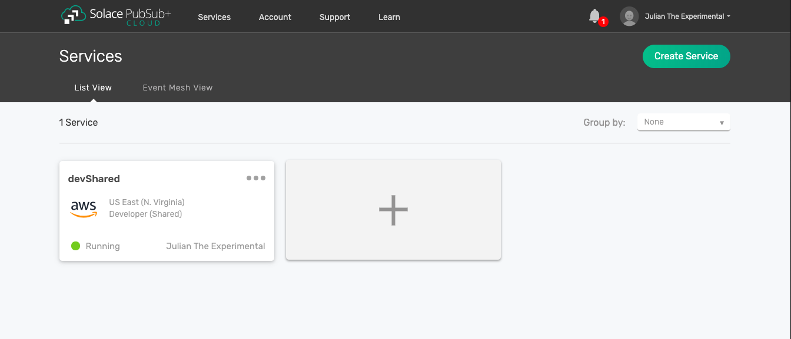
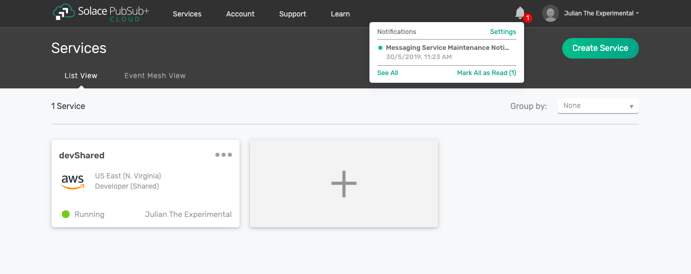
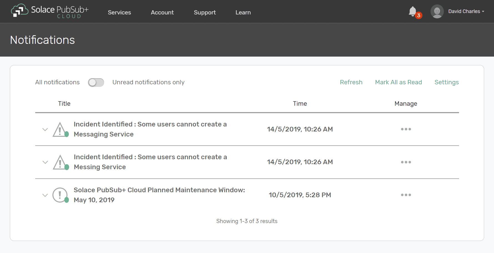
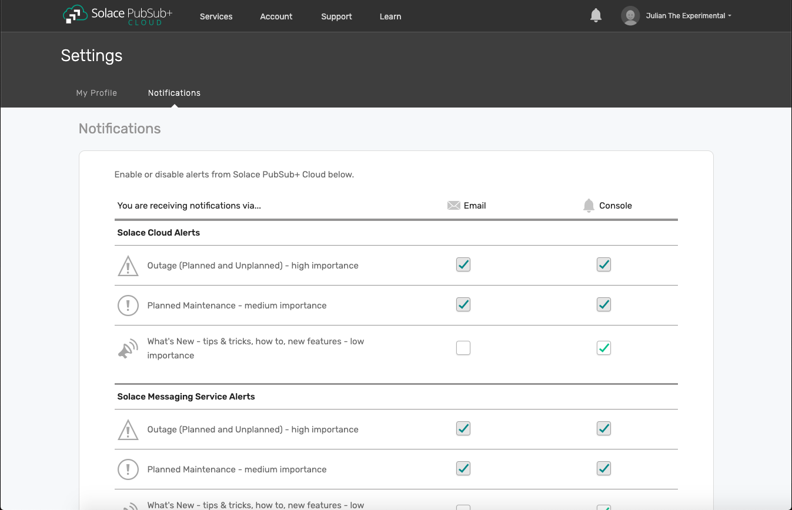

System Notifications Preferences
================================

Notification preferences allow you to choose how you will receive news about PubSub+ Cloud,
either through email or through the new Console notification feature. When you log in to the Console, you’ll notice a notification bell icon at the top right of the screen.

In the below image, one new notifications is waiting for you.

Clicking on the bell icon will give you a preview of the unread notifications.

You can jump to any of the notifications by clicking on it, or go to inbox by selecting “See All”. You have
lots of options for how to manage notifications from within the Notifications tab.

With our Notification Preference Settings you can view and modify your settings.
When you click on Settings, the Console will display a list of Solace Cloud alerts and Solace messaging service alerts
which can be customized to suit your preferences.

There are different categories of notifications which you could enable/disable:

**Solace Cloud and separately Solace Message services**:

- **Outage** (planned & unplanned) - High level of importance - due to impact of system availability. High impact on the user's use of the system
- **Planned** maintenance - Medium level importance - advanced notice of changes to system, may have an availability concern
- **What's new** - Low level of importance -  tips & tricks, how to, new features - informational only

**Marketing**:

- Nurture program
- Promotional
- New Product

Administrators have slightly fewer options about what they can unselect, but individual users can decide exactly how they receive PubSub+ notifications.
